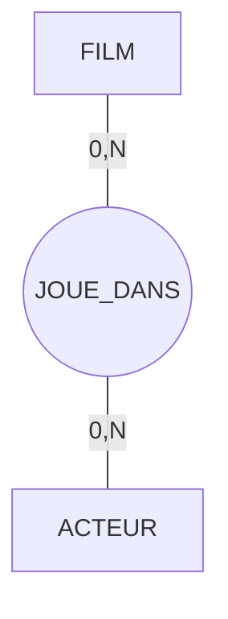
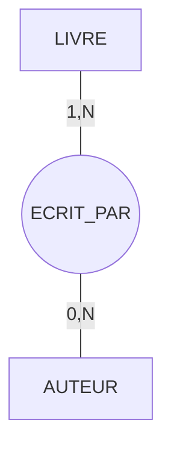
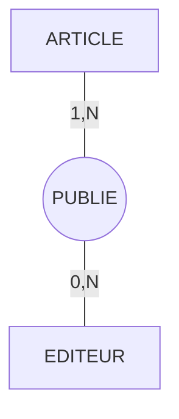
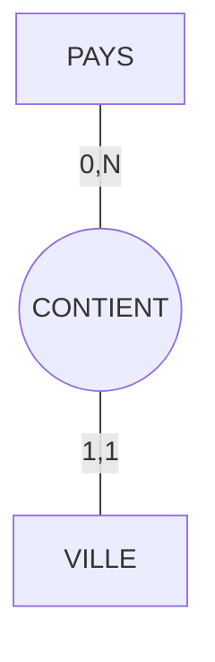
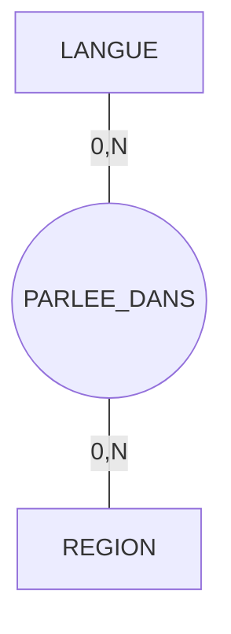
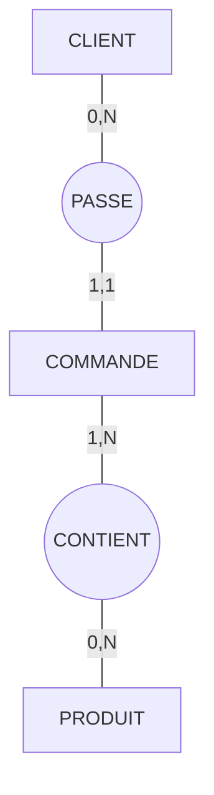
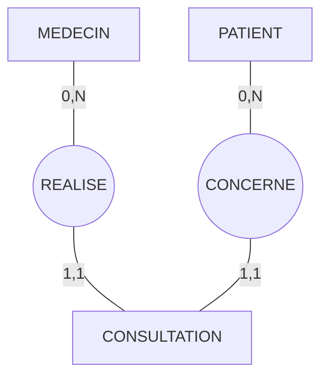
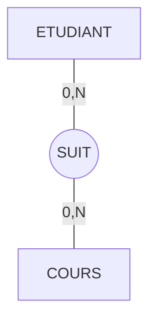

## Exercice 1 : Cinéma – Films et Acteurs

**Cardinalités** :
- Un film peut avoir zéro ou plusieurs acteurs
- Un acteur peut jouer dans zéro ou plusieurs films

### **Penser "base de données"**

Quand on dit "un film peut avoir zéro ou plusieurs acteurs", on ne parle pas de tous les films en général, mais **d'un film précis** dans la base.

**Exemple concret** :
- Le film "Inception" (un enregistrement) a 5 acteurs dans la base
- Le film "The Room" (un autre enregistrement) a 3 acteurs
- Le film "Court-métrage indépendant" (encore un autre) n'a aucun acteur enregistré pour l'instant (0)

De l'autre côté, l'acteur "Leonardo DiCaprio" (un enregistrement) a joué dans 25 films enregistrés dans la base.

Les cardinalités décrivent **combien d'enregistrements peuvent être liés**, pas des généralités sur la table entière.

---

## Exercice 2 : Librairie – Livres et Auteurs

**Cardinalités** :
- Un livre est écrit par un ou plusieurs auteurs
- Un auteur peut écrire zéro ou plusieurs livres

### **Penser "base de données"**

"Un livre est écrit par un ou plusieurs auteurs" signifie : **chaque ligne de la table LIVRE** doit être liée à au moins une ligne de la table AUTEUR.

**Exemple concret** :
- Le livre ISBN "978-2-1234-5678-9" (un enregistrement) est écrit par 1 auteur
- Le livre ISBN "978-2-9876-5432-1" (un autre enregistrement) est écrit par 3 auteurs
- Impossible d'avoir un livre sans auteur dans cette base (le minimum est 1)

Du côté auteur, l'auteur "Marie Dupont" (un enregistrement) peut avoir écrit 0 livres si elle vient d'être ajoutée, ou 50 livres si elle est prolifique.

**Pourquoi (1,N) et pas (0,N) ?** Dans une librairie, on n'enregistre pas de livres sans connaître l'auteur. C'est une règle métier : tout livre doit avoir au moins un auteur.

---

## Exercice 3 : Blog – Articles et Éditeurs

**Cardinalités** :
- Un article est publié/modifié par un ou plusieurs éditeurs
- Un éditeur peut publier zéro ou plusieurs articles

### **Penser "base de données"**

**Chaque article** (une ligne spécifique) doit être lié à au moins un éditeur qui l'a publié ou modifié.

**Exemple concret** :
- L'article #1245 "Les bases de données expliquées" a été publié par 1 éditeur
- L'article #1246 "Guide complet SQL" a été modifié par 4 éditeurs différents au fil du temps
- Impossible d'avoir un article sans éditeur (minimum 1)

L'éditeur "Jean Martin" (un enregistrement) peut avoir publié 0 article s'il vient d'être embauché, ou 300 articles s'il travaille là depuis des années.

**La règle métier** : Un article ne peut pas exister dans le système sans qu'un éditeur l'ait créé. C'est pour ça que le minimum est 1, pas 0.

---

## Exercice 4 : Transport – Pays et Villes

**Cardinalités** :
- Un pays contient zéro ou plusieurs villes
- Une ville appartient à un et un seul pays

### **Penser "base de données"**

Attention au piège ! "Un pays contient zéro ou plusieurs villes" ne veut pas dire qu'un pays réel n'a pas de villes. Cela signifie : **dans notre base de données**, un pays (un enregistrement) peut être présent sans qu'on ait encore enregistré ses villes.

**Exemple concret** :
- Le pays "France" (code ISO: FR) a 150 villes enregistrées dans la base
- Le pays "Monaco" (code ISO: MC) a 1 ville enregistrée
- Le pays "Nauru" (code ISO: NR) a 0 ville enregistrée pour l'instant, mais le pays existe dans la table PAYS

De l'autre côté, la ville "Paris" (un enregistrement) appartient à exactement 1 pays : la France. Elle ne peut pas appartenir à 0 pays (elle doit être quelque part) ni à 2 pays (une ville n'est que dans un seul pays).

**Pourquoi (0,N) pour le pays ?** Parce qu'on veut pouvoir enregistrer un pays dans le système avant d'avoir référencé toutes ses villes. Sinon, il faudrait tout saisir d'un coup, ce qui n'est pas pratique.

---

## Exercice 5 : Langues du monde

**Cardinalités** :
- Une langue peut être parlée dans zéro ou plusieurs régions
- Une région peut avoir zéro ou plusieurs langues

### **Penser "base de données"**

Ici, les deux côtés ont (0,N), ce qui signifie qu'on peut enregistrer des langues et des régions **indépendamment** avant de les lier.

**Exemple concret** :
- La langue "Français" (code ISO: FR) est parlée dans 35 régions de la base
- La langue "Aïnou" (code ISO: AIN) est parlée dans 1 région
- La langue "Latin" (code ISO: LA) est dans la base mais n'est liée à aucune région actuelle (0) car c'est une langue morte

De l'autre côté :
- La région "Québec" a 3 langues enregistrées (français, anglais, langues autochtones)
- La région "Île déserte X" a 0 langue enregistrée pour l'instant

**Pourquoi (0,N) des deux côtés ?** Parce qu'on veut un catalogue complet de langues (même mortes) et de régions (même non documentées). On les relie ensuite progressivement.

---

## Exercice 6 : E-commerce – Clients et Produits

**Cardinalités** :
- Un client peut passer zéro ou plusieurs commandes
- Une commande est passée par un et un seul client
- Une commande contient un ou plusieurs produits
- Un produit peut être dans zéro ou plusieurs commandes

### **Penser "base de données"**

Ce modèle montre **3 tables** liées par **2 relations**.

**Exemple concret pour CLIENT → COMMANDE** :
- Le client #12345 "Alice Dubois" a passé 8 commandes dans la base
- Le client #12346 "Bob Martin" vient de s'inscrire : 0 commande
- La commande #98765 appartient à un seul client : Alice Dubois

**Pourquoi (0,N) pour le client ?** On veut pouvoir créer un compte client avant qu'il n'achète quoi que ce soit.

**Exemple concret pour COMMANDE → PRODUIT** :
- La commande #98765 contient 3 produits (un livre, un stylo, un cahier)
- La commande #98766 contient 1 produit
- Le produit "Clavier mécanique" (REF: KB-001) apparaît dans 45 commandes différentes
- Le produit "Souris gaming" (REF: MS-002) vient d'être ajouté : 0 commande pour l'instant

**Pourquoi (1,N) pour la commande ?** Une commande vide n'a aucun sens. Si elle existe, c'est qu'elle contient au moins un produit.

**Pourquoi (0,N) pour le produit ?** Un produit peut exister dans le catalogue avant d'avoir été commandé.

---

## Exercice 7 : Hôpital – Médecins et Patients

**Cardinalités** :
- Un médecin peut réaliser zéro ou plusieurs consultations
- Une consultation est réalisée par un et un seul médecin
- Un patient peut avoir zéro ou plusieurs consultations
- Une consultation concerne un et un seul patient

### **Penser "base de données"**

Ici, CONSULTATION est **une entité centrale** qui lie médecins et patients. Chaque consultation est un événement précis.

**Exemple concret côté MEDECIN** :
- Le Dr. Dupont (ID: 001) a réalisé 1250 consultations dans la base
- Le Dr. Martin (ID: 002) vient d'être embauché : 0 consultation
- La consultation #789 a été réalisée par un seul médecin : Dr. Dupont

**Exemple concret côté PATIENT** :
- Le patient "Marie Leblanc" (ID: 5001) a eu 15 consultations dans la base
- Le patient "Pierre Noir" (ID: 5002) vient de s'inscrire : 0 consultation
- La consultation #789 concerne un seul patient : Marie Leblanc

**Pourquoi (1,1) des deux côtés pour CONSULTATION ?**
Une consultation ne peut pas exister sans médecin ET sans patient. C'est l'événement qui les relie. On ne peut pas avoir :
- Une consultation sans médecin (qui l'aurait réalisée ?)
- Une consultation sans patient (qui aurait été consulté ?)
- Une consultation avec 2 médecins en même temps (dans ce modèle simplifié)
- Une consultation avec 2 patients en même temps (chaque consultation = 1 patient)

---

## Exercice 8 : École – Étudiants et Cours

**Cardinalités** :
- Un étudiant peut suivre zéro ou plusieurs cours
- Un cours peut être suivi par zéro ou plusieurs étudiants

### **Penser "base de données"**

Les deux côtés sont (0,N), ce qui donne beaucoup de flexibilité au système.

**Exemple concret côté ETUDIANT** :
- L'étudiant "Alice Martin" (ID: 20230145) suit 6 cours ce semestre
- L'étudiant "Bob Durand" (ID: 20230146) vient de s'inscrire mais n'a pas encore choisi ses cours : 0 cours
- L'étudiant "Clara Petit" (ID: 20230147) est en congé : 0 cours ce semestre

**Exemple concret côté COURS** :
- Le cours "Bases de données" (code: INFO-301) a 45 étudiants inscrits
- Le cours "Algorithmique avancée" (code: INFO-401) a 12 étudiants inscrits
- Le cours "Nouvelle matière test" (code: INFO-501) vient d'être créé : 0 étudiant inscrit

**Pourquoi (0,N) des deux côtés ?**
- Un étudiant peut être inscrit à l'université sans encore avoir choisi ses cours (période d'inscription)
- Un cours peut exister dans le catalogue sans qu'aucun étudiant ne s'y soit inscrit (nouveau cours, cours optionnel peu populaire)

Cette flexibilité permet de gérer les périodes d'inscription, les cours annulés faute d'étudiants, les étudiants en pause, etc.