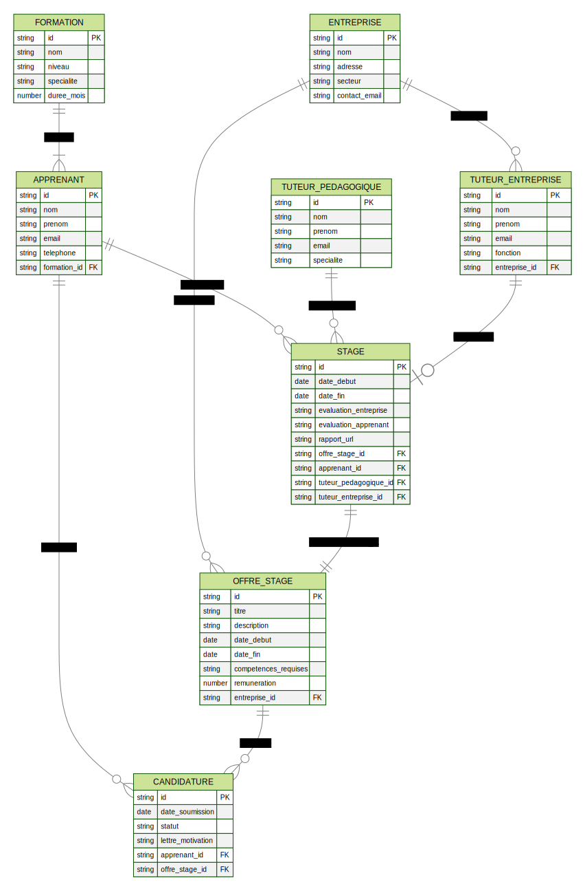

# MERISE

## Explications des trois niveaux de modélisation

### Niveau Conceptuel
Le modèle conceptuel représente la réalité métier indépendamment des contraintes techniques. Il identifie les entités importantes (APPRENANT, ENTREPRISE, STAGE, etc.) et leurs relations fonctionnelles. Ce niveau se concentre sur:
- Les objets métier essentiels
- Les relations entre ces objets
- Les attributs de base de chaque entité
- Les cardinalités des relations

### Niveau Logique
Le modèle logique transforme le modèle conceptuel en une structure organisée pour un système de gestion de base de données, mais reste indépendant d'un SGBD spécifique. Les modifications incluent:
- Transformation des entités en tables avec des noms en minuscules au pluriel
- Introduction des clés primaires (PK) et étrangères (FK)
- Définition des types de données génériques (VARCHAR, DATE, TEXT)
- Modélisation des relations par des clés étrangères

### Niveau Physique
Le modèle physique définit l'implémentation technique concrète dans un SGBD spécifique. Les caractéristiques ajoutées sont:
- Types de données précis avec leurs tailles (varchar(36), decimal(10,2))
- Contraintes d'intégrité (NOT NULL, UNIQUE, DEFAULT)
- Index pour optimiser les performances des requêtes
- Colonnes techniques (created_at, updated_at)
- Contraintes d'unicité spécifiques
- Valeurs par défaut pour certains champs

Ces trois niveaux représentent le processus progressif de transformation d'un modèle métier abstrait en une implémentation technique concrète et optimisée.

---
## Exemple

### Niveau Conceptuel

---

### Niveau Logique

---
### Niveau Physique

[SQL DDL](MERISE_MPD.sql)

