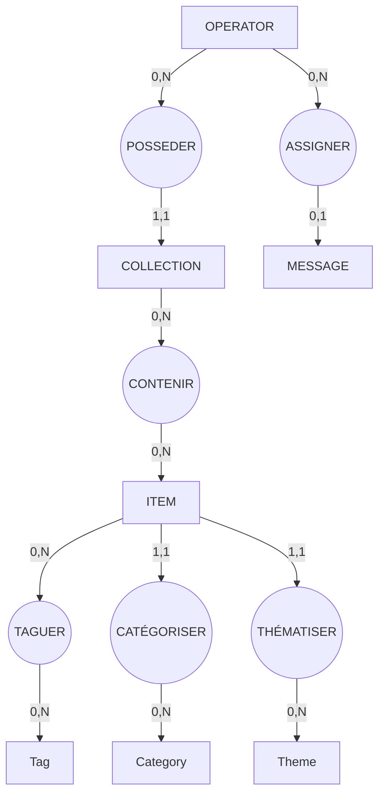
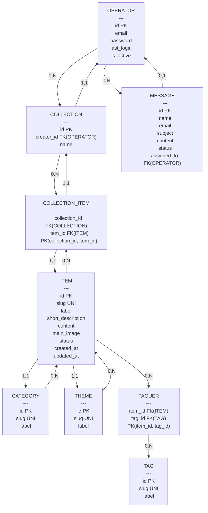

# **Session 08 — Correction complète : du cahier des charges au SQL final**

---

# ## 🎯 Objectifs de cette séance

Dans cette session, l'étudiant doit :

* comparer son travail aux bonnes pratiques
* vérifier la cohérence du MCD
* comprendre les transformations du MLD
* lire et analyser un MPD SQL professionnel
* corriger les erreurs typiques rencontrées dans le processus

Cette séance clôt la trilogie de modélisation.

---

# ## 1. Correction de l’analyse du cahier des charges

### Entités attendues

* **Operator**
* **Item**
* **Category**
* **Theme**
* **Tag**
* **Message**
* **Collection**
* **Collection_Item** (table associative)
* **Taguer** (table associative)

### Critères de validité

Une bonne analyse doit :

* Séparer clairement rôles / contenus / actions
* Ne pas mélanger logique métier et logique de gestion (ex: “gérer” n’est pas une entité)
* Identifier toutes les relations obligatoires du cahier des charges

### ❌ Erreurs fréquentes des étudiants

* Confondre "admin" et "operator"
* Oublier les tags libres
* Oublier la table d’association item_tag
* Créer des entités inutiles ("GERER", "POSSEDER", "ASSIGNER", etc.)
* Doubler category/theme/tag alors qu’ils ont des attributs identiques

---

# ## 2. Correction du MCD (Modèle Conceptuel de Données)

Voici le **MCD correct**, conforme au cahier des charges ET à Merise.

### ### Règles appliquées

* Item doit avoir **exactement 1** catégorie
* Item doit avoir **exactement 1** thème
* Item peut avoir **0,N** tags libres
* Un operator peut créer **0,N** collections
* Un operator peut être assigné à **0,1** messages
* Relations N,N transformées en entités associatives

### ### MCD corrigé (verbal)

| Entité               | Relations correctes                      |
| -------------------- | ---------------------------------------- |
| **Item**             | 1,1 → Category ; 1,1 → Theme ; 0,N → Tag |
| **Tag**              | N,N via Taguer                           |
| **Collection**       | 1 operator → N collections               |
| **Collection_Item**  | N,N association résolue                  |
| **Message**          | 0,1 → Operator                           |
| **Category / Theme** | Relations 1,N depuis Item                |

### ❌ Erreurs typiques trouvées et corrigées

* “GÉRER” représenté comme entité → supprimé
* Cardinalités imprécises (1,N écrits comme 0,N) → corrigés
* Absence de relation Message→Operator → corrigée
* Catégorie/Thème modélisés comme tables indépendantes sans lien item → corrigé

---

# ## 3. Correction du MLD (Modèle Logique Relationnel)

Le MLD reprend le MCD en suivant ces règles :

### Entité = table

### Clé primaire choisie → AUTO_INCREMENT

### 1,N = FK côté N

### 1,1 = FK NOT NULL

### 0,1 = FK NULLABLE

### N,N = table associative (PK composée)

### Tous les noms d’attributs deviennent SQL-compatibles

### MLD correct attendu

| Table           | Clés                               | Commentaires               |
| --------------- | ---------------------------------- | -------------------------- |
| operator        | id PK                              | —                          |
| collection      | id PK, creator_id FK               | 1 operator = N collections |
| collection_item | (collection_id, item_id) PK        | table associative          |
| message         | id PK, assigned_to FK NULL         | relation 0,1               |
| item            | id PK, category_id FK, theme_id FK | relations 1,1              |
| category        | id PK                              | —                          |
| theme           | id PK                              | —                          |
| tag             | id PK                              | —                          |
| taguer          | (item_id, tag_id) PK               | table associative          |

---

# ## 4. Correction du MPD (Modèle Physique MySQL)

### Bonnes pratiques attendues

* Créer les tables **avant** d’ajouter les clés étrangères
* Utiliser `ALTER TABLE ... ADD CONSTRAINT`
* Utiliser des `ON DELETE` cohérents avec les cardinalités
* Utiliser les bons types SQL
* Encodage utf8mb4
* Noms de contraintes explicites

Les tables **sans FKs** étaient correctes si :

* Les types choisies sont cohérents
* Les attributs obligatoires sont NOT NULL
* slug / email sont bien en UNIQUE

Les tables **avec FKs** doivent respecter les règles MCD :

| Cardinalité MCD | Traduction SQL                   |
| --------------- | -------------------------------- |
| **1,1**         | FK NOT NULL + ON DELETE RESTRICT |
| **0,1**         | FK NULLABLE + ON DELETE SET NULL |
| **1,N**         | FK NOT NULL sur côté N           |
| **N,N**         | table associative PK composée    |

### Résultat : Script SQL final corrigé

(Vu dans la séance précédente, il fait référence pour la correction)

---

# ## 5. Points clés corrigés chez les étudiants

### 1. Trop d’entités inutiles

Beaucoup d’étudiants modélisent :

* Gérer
* Attribuer
* Posséder

→ **Ces termes décrivent des actions, pas des entités.**
→ Elles ne DOIVENT PAS apparaître dans un MCD.

### 2. Mauvaises cardinalités

Exemples fréquents :

* Item → Tag en 1,N au lieu de N,N
* Message → Operator en 1,1 au lieu de 0,1
* Operator → Collection en 0,1 au lieu de 1,N

### 3. Mauvaises clés primaires dans tables associatives

→ Correction : **toujours** `(FK1, FK2)`.

### 4. FKs non cohérentes avec le MCD

→ Correction appliquée :

* NOT NULL pour relations obligatoires
* NULLABLE pour relations optionnelles

### 5. Types SQL non adaptés

→ Correction :

* INT UNSIGNED pour les PK
* VARCHAR(255) pour les slugs, labels, emails
* ENUM pour les statuts

---

# ## 6. Résultat attendu

### Un MCD propre, lisible, sans bruit administratif

### Un MLD normalisé, cohérent, structuré

### Un MPD SQL professionnel avec ALTER TABLE

### Un pipeline complet : **Métier → Concept → Logique → Physique**

---

# ## 7. Mini-correction interactive (15 min)

### **Question 1**

Pourquoi `message.assigned_to` doit-il être NULLABLE ?

**Réponse attendue :**
Parce que la cardinalité est **0,1**, donc un message peut exister sans être assigné à un opérateur.

---

### **Question 2**

Pourquoi `item.category_id` ne doit-il jamais être NULL ?

**Réponse :**
Relation **1,1** : tout item doit obligatoirement appartenir à une catégorie.

---

### **Question 3**

Pourquoi crée-t-on la table `taguer` ?

**Réponse :**
Parce que la relation Item–Tag est **N,N**, impossible à représenter directement dans SQL.

---

### **Question 4**

Pourquoi met-on `ON DELETE RESTRICT` sur category/theme, et `ON DELETE CASCADE` ailleurs ?

**Réponse :**
Parce qu’on ne veut pas supprimer des catégories/thèmes si des items les utilisent (intégrité éditoriale).
Mais on doit supprimer automatiquement les liens dans les tables associatives lorsqu’un item ou une collection disparaît.

---

# ## 8. Conclusion

Cette correction clôt la trilogie :

1. **Analyse du besoin (Session 06)**
2. **MCD + MLD + MPD (Session 07)**
3. **Correction finale + justification (Session 08)**

# MCD


# MLD



```sql
/* =========================================================
   TABLE: OPERATOR
   Origin: Entity in MCD (administrators / operators)
========================================================= */
CREATE TABLE operator (
    id INT UNSIGNED AUTO_INCREMENT PRIMARY KEY,
    email VARCHAR(255) NOT NULL UNIQUE,
    password VARCHAR(255) NOT NULL,
    last_login DATETIME NULL,
    is_active TINYINT(1) NOT NULL DEFAULT 1
) ENGINE=InnoDB DEFAULT CHARSET=utf8mb4;

/* =========================================================
   TABLE: CATEGORY
   MCD: ITEM → CATEGORY is (1,1), so FK will be NOT NULL
========================================================= */
CREATE TABLE category (
    id INT UNSIGNED AUTO_INCREMENT PRIMARY KEY,
    slug VARCHAR(255) NOT NULL UNIQUE,
    label VARCHAR(255) NOT NULL
) ENGINE=InnoDB DEFAULT CHARSET=utf8mb4;

/* =========================================================
   TABLE: THEME
   MCD: ITEM → THEME is (1,1), FK NOT NULL
========================================================= */
CREATE TABLE theme (
    id INT UNSIGNED AUTO_INCREMENT PRIMARY KEY,
    slug VARCHAR(255) NOT NULL UNIQUE,
    label VARCHAR(255) NOT NULL
) ENGINE=InnoDB DEFAULT CHARSET=utf8mb4;

/* =========================================================
   TABLE: TAG
   Used only for 0,N free tagging
========================================================= */
CREATE TABLE tag (
    id INT UNSIGNED AUTO_INCREMENT PRIMARY KEY,
    slug VARCHAR(255) NOT NULL UNIQUE,
    label VARCHAR(255) NOT NULL
) ENGINE=InnoDB DEFAULT CHARSET=utf8mb4;

/* =========================================================
   TABLE: ITEM
   MCD:
     - CATEGORY 1,1 → category_id NOT NULL
     - THEME 1,1 → theme_id NOT NULL
========================================================= */
CREATE TABLE item (
    id INT UNSIGNED AUTO_INCREMENT PRIMARY KEY,
    slug VARCHAR(255) NOT NULL UNIQUE,
    label VARCHAR(255) NOT NULL,
    short_description TEXT NULL,
    content LONGTEXT NULL,
    main_image VARCHAR(255),
    status ENUM('draft','published','archived') DEFAULT 'draft',
    created_at DATETIME NOT NULL,
    updated_at DATETIME NOT NULL,

    category_id INT UNSIGNED NOT NULL,   -- (1,1)
    theme_id INT UNSIGNED NOT NULL       -- (1,1)
) ENGINE=InnoDB DEFAULT CHARSET=utf8mb4;

/* =========================================================
   TABLE: COLLECTION
   MCD:
     OPERATOR 1,N → COLLECTION (creator_id NOT NULL)
========================================================= */
CREATE TABLE collection (
    id INT UNSIGNED AUTO_INCREMENT PRIMARY KEY,
    creator_id INT UNSIGNED NOT NULL,
    name VARCHAR(255) NOT NULL
) ENGINE=InnoDB DEFAULT CHARSET=utf8mb4;

/* =========================================================
   TABLE: COLLECTION_ITEM  (junction)
   MCD: COLLECTION 0,N — 0,N ITEM
========================================================= */
CREATE TABLE collection_item (
    collection_id INT UNSIGNED NOT NULL,
    item_id INT UNSIGNED NOT NULL,
    PRIMARY KEY (collection_id, item_id)
) ENGINE=InnoDB DEFAULT CHARSET=utf8mb4;

/* =========================================================
   TABLE: MESSAGE
   MCD:
     OPERATOR 0,1 → MESSAGE
     Means: assigned_to must be NULLABLE
========================================================= */
CREATE TABLE message (
    id INT UNSIGNED AUTO_INCREMENT PRIMARY KEY,
    name VARCHAR(255) NOT NULL,
    email VARCHAR(255) NOT NULL,
    subject VARCHAR(255),
    content TEXT NOT NULL,
    status ENUM('new','read','archived') DEFAULT 'new',

    assigned_to INT UNSIGNED NULL      -- (0,1)
) ENGINE=InnoDB DEFAULT CHARSET=utf8mb4;

/* =========================================================
   TABLE: TAGUER (item_tag)
   MCD: ITEM 0,N — 0,N TAG
========================================================= */
CREATE TABLE taguer (
    item_id INT UNSIGNED NOT NULL,
    tag_id INT UNSIGNED NOT NULL,
    PRIMARY KEY (item_id, tag_id)
) ENGINE=InnoDB DEFAULT CHARSET=utf8mb4;
```
