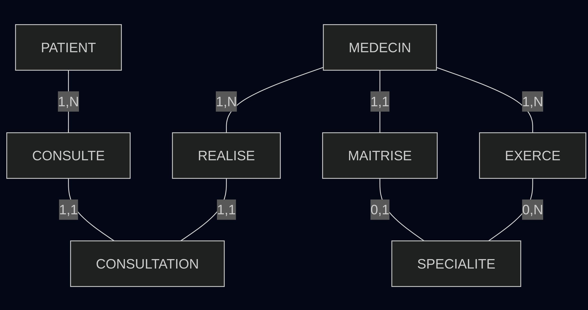

# Solution Session 4 : MCD Gestion de consultations médicales

# **1. Analyse & Modélisation**

## **Entités principales**

* **PATIENT** : Contient les informations personnelles permettant d’identifier et suivre les patients.
* **MEDECIN** : Représente les médecins de la clinique, chacun associé à une spécialité principale et éventuellement plusieurs spécialités secondaires.
* **SPECIALITE** : Catalogue des spécialités médicales proposées (cardiologie, pédiatrie…). Une spécialité peut momentanément **ne pas être exercée** si aucun médecin ne l’a actuellement.
* **CONSULTATION** : Acte médical incluant des informations précises : date, heure, durée, diagnostic, tarif, statut.

---
Voici **ta version reformattée** dans le même style que l’exemple fourni :

---

## **Associations**

* PATIENT —< CONSULTATION
* MEDECIN —< CONSULTATION
* MEDECIN —1 MAITRISE 1— SPECIALITE (spécialité principale)
* MEDECIN —< EXERCE >— SPECIALITE (spécialités exercées)

---

## **Cardinalités**

* Un patient a **1 à N** consultations
* Une consultation concerne **1 seul patient**
* Un médecin réalise **1 à N** consultations
* Une consultation est effectuée par **1 seul médecin**
* Un médecin possède **exactement 1** spécialité principale
* Une spécialité peut être la principale de **0 à N** médecins
* Un médecin exerce **1 à N** spécialités (principale incluse)
* Une spécialité peut être exercée par **0 à N** médecins

---

## **Fonctionnement global du système**

Le système permet :

* d’enregistrer les patients et leurs informations personnelles,
* de gérer les médecins et leur **spécialité principale** ainsi que leurs **spécialités secondaires**,
* de documenter les consultations avec détails médicaux, durée, diagnostic et statut,
* de suivre quels médecins réalisent quelles consultations,
* de gérer un catalogue de spécialités indépendamment de l’existence d’un médecin (cas d’une spécialité momentanément non exercée).

---




---

# 3. Explication des cardinalités

## **1. PATIENT — CONSULTE — CONSULTATION**

### **PATIENT → CONSULTE : (1,N)**

* Un patient **doit avoir au moins une consultation** au cours de sa présence dans le système (1).
* Un patient peut avoir **plusieurs consultations** au fil du temps (N).

### **CONSULTE → CONSULTATION : (1,1)**

* Chaque occurrence de l'association CONSULTE correspond à **une seule consultation précise** (1).
* Une consultation concerne **exactement un seul patient** (1).

➡️ Ensemble :
**Un patient peut avoir plusieurs consultations, mais chaque consultation appartient à un seul patient.**

---

## **2. MEDECIN — REALISE — CONSULTATION**

### **MEDECIN → REALISE : (1,N)**

* Un médecin **réalise au minimum une consultation** (1).
* Un médecin peut en réaliser **plusieurs** (N).

### **REALISE → CONSULTATION : (1,1)**

* Chaque consultation est assurée par **exactement un médecin** (1).
* Une occurrence de REALISE correspond à **une seule consultation** (1).

➡️ Ensemble :
**Un médecin réalise plusieurs consultations, mais chaque consultation est faite par un seul médecin.**

---

## **3. MEDECIN — MAITRISE — SPECIALITE**

*(la spécialité principale du médecin)*

### **MEDECIN → MAITRISE : (1,1)**

* Chaque médecin doit avoir **exactement une spécialité principale**.
* Pas 0 (elle est obligatoire), pas 2 (elle doit être unique).

### **MAITRISE → SPECIALITE : (0,N)**

* Une spécialité peut être choisie comme spécialité principale par **plusieurs médecins** (N).
* Mais une spécialité peut aussi **ne pas avoir de médecin** pour le moment (0).

➡️ Ensemble :
**Un médecin possède une seule spécialité principale, et une spécialité peut être principale pour zéro, un ou plusieurs médecins.**

---

## **4. MEDECIN — EXERCE — SPECIALITE**

*(les spécialités secondaires)*

### **MEDECIN → EXERCE : (1,N)**

* Chaque médecin exerce **au moins une spécialité**, parce que sa spécialité principale en fait partie (1).
* Il peut exercer **plusieurs spécialités** au total (N).
  ➡️ Cette relation inclut potentiellement la spécialité principale, ou seulement les secondaires selon ton choix conceptuel.

### **EXERCE → SPECIALITE : (0,N)**

* Une spécialité peut être exercée par **aucun médecin** (0).
* Une spécialité peut être exercée par **plusieurs médecins** (N).

➡️ Ensemble :
**Chaque médecin exerce au minimum une spécialité, et une spécialité peut être exercée par 0 à plusieurs médecins.**

---

# Code mermaid

```
graph TD
    PATIENT["PATIENT
    id
    nom
    prenom
    date_naissance
    adresse
    telephone"]
    
    MEDECIN["MEDECIN
    id
    nom
    prenom"]
    
    SPECIALITE["SPECIALITE
    id
    libelle"]
    
    CONSULTATION["CONSULTATION
    id
    date_consult
    heure
    duree
    diagnostic
    tarif
    statut"]

    MAITRISE["MAITRISE"]
    EXERCE["EXERCE"]
    CONSULTE["CONSULTE"]
    REALISE["REALISE"]
    
    PATIENT --- |"1,N"| CONSULTE
    CONSULTE --- |"1,1"| CONSULTATION

    MEDECIN --- |"1,N"| REALISE
    REALISE --- |"1,1"| CONSULTATION

    MEDECIN --- |"1,1"| MAITRISE
    MAITRISE --- |"0,N"| SPECIALITE

    MEDECIN --- |"1,N"| EXERCE
    EXERCE --- |"0,N"| SPECIALITE
```
