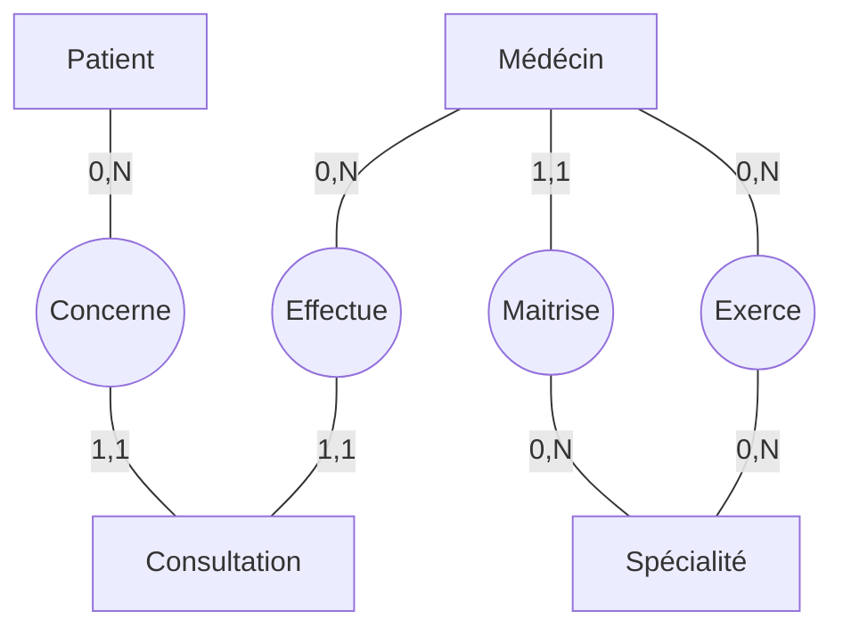

# Solution Session 4 : MCD Gestion de consultations médicales

# **1. Analyse & Modélisation**

## **Entités**

* **PATIENT** : Contient les informations personnelles permettant d'identifier et suivre les patients.
* **MEDECIN** : Représente les médecins de la clinique, chacun associé à une spécialité principale et éventuellement plusieurs spécialités secondaires.
* **SPECIALITE** : Catalogue des spécialités médicales proposées (cardiologie, pédiatrie…). Une spécialité peut momentanément **ne pas être exercée** si aucun médecin ne l'a actuellement.
* **CONSULTATION** : Acte médical incluant des informations précises : date, heure, durée, diagnostic, tarif, statut.

---

## **Associations**

* PATIENT — CONSULTATION — MEDECIN
* MEDECIN — SPECIALITE (spécialité principale)
* MEDECIN — SPECIALITE (spécialités secondaires uniquement)

---

## **Cardinalités**

### PATIENT — CONSULTATION — MEDECIN
* Un patient peut n'avoir eu aucune consultation, comme il peut en avoir eu plusieurs
* Une consultation concerne un et un seul patient
* **CONCERNE**  

* Un médecin peut n'avoir réalisé aucune consultation, comme il peut en avoir réalisé plusieurs
* Une consultation est effectuée par un et un seul médecin
* **EFFECTUE** ou **REALISE**

### MEDECIN — SPECIALITE (spécialité principale)
* Un médecin possède une et une seule spécialité principale
* Une spécialité peut n'être la principale d'aucun médecin, comme elle peut être la principale de plusieurs médecins
* **MAITRISE**

### MEDECIN — SPECIALITE (spécialités secondaires uniquement)
* Un médecin peut n'exercer aucune spécialité secondaire, comme il peut en exercer plusieurs
* Une spécialité peut n'être exercée comme secondaire par aucun médecin, comme elle peut être exercée comme secondaire par plusieurs médecins
* **EXERCE**

---

## **Fonctionnement global du système**

Le système permet :

* d'enregistrer les patients et leurs informations personnelles,
* de gérer les médecins et leur **spécialité principale** (via MAITRISE) ainsi que leurs **spécialités secondaires** (via EXERCE),
* de documenter les consultations avec détails médicaux, durée, diagnostic et statut,
* de suivre quels médecins réalisent quelles consultations,
* de gérer un catalogue de spécialités indépendamment de l'existence d'un médecin (cas d'une spécialité momentanément non exercée).

**Note importante** : MAITRISE et EXERCE sont **disjointes**. La spécialité principale d'un médecin ne peut pas apparaître dans EXERCE.

---

See it [live on mermaid](https://mermaid.live/edit#pako:eNqVUstqwzAQ_BWzpwSUEOXlWDfj6GDIC8eB0qoHUatJaG0H1Ya2Sf69siw7ItBCD4bZmdXsetgzvOSJAAJ7yU8HJ56zzHE2fhzSVfzEwCAGzxW_pHMahCvFG2T47UYV_iKMqZJuhVGrL1ivtrtFrNzW1XO71F3a3Q_jKNzSTkf5G8yg2600-kCjQCs1anhjpJUGN1pE1Ra1nYGNYv2j0-v1nAuDAVKLXFo_27tpwQhbLfXumRXLnVUz87bJf41MX5uFldHdLCvzPzYy0bVx_moCSJ3DMQHyyt8_BIJUyJRXNZx1fFAcRCoYEAUTLt8YsOyqHp149pjnKZBCluqZzMv9oTUpTwkvxPzI1aWlLStFlggZ5GVWAMEj7QHkDJ9Ahu6o7w4nU2_szfAYD2YIvoBMp308HHsV5WLP89wrgm89dNCfuRMEIjkWuVzWV62P-_oDUFjQEw)

---
# 3. Explication des cardinalités

## **1. PATIENT — CONSULTE — CONSULTATION**

### **Du côté PATIENT : (0,N)**

Un patient peut exister dans le système sans avoir encore consulté. C'est le cas d'un patient nouvellement enregistré qui prend son premier rendez-vous. Au fil du temps, ce même patient peut revenir pour plusieurs consultations.

### **Du côté CONSULTATION : (1,1)**

Chaque consultation est liée à un patient précis. On ne peut pas avoir une consultation "sans patient" ou une consultation "partagée entre plusieurs patients". C'est logique : quand un médecin consulte, il voit une personne à la fois.

**En résumé** : Un patient peut avoir consulté 0, 1, 2, 10 fois... mais chaque consultation concerne toujours un seul et unique patient.

---

## **2. MEDECIN — REALISE — CONSULTATION**

### **Du côté MEDECIN : (0,N)**

Un médecin nouvellement embauché n'a pas encore réalisé de consultation. C'est normal, il vient d'arriver. Avec le temps, il va accumuler des consultations : 1, puis 10, puis 100...

### **Du côté CONSULTATION : (1,1)**

Une consultation est toujours assurée par un médecin et un seul. On ne peut pas avoir une consultation réalisée par "personne" ni par "deux médecins en même temps" (dans ce modèle simplifié).

**En résumé** : Un médecin peut avoir fait 0 consultation (il débute) ou des centaines (il est expérimenté), mais chaque consultation a toujours été faite par un seul médecin.

---

## **3. MEDECIN — MAITRISE — SPECIALITE**

*(la spécialité principale du médecin)*

### **Du côté MEDECIN : (1,1)**

Chaque médecin doit obligatoirement déclarer une spécialité principale. C'est son domaine d'expertise de base. Il ne peut pas en avoir zéro (sinon il ne serait pas qualifié) ni deux (il faut choisir la principale).

### **Du côté SPECIALITE : (0,N)**

Une spécialité peut exister dans le catalogue sans qu'aucun médecin ne l'ait choisie comme principale pour le moment. Par exemple, la clinique propose "Neurologie" mais aucun neurologue n'y travaille actuellement. À l'inverse, plusieurs médecins peuvent avoir choisi "Médecine générale" comme spécialité principale.

**En résumé** : Chaque médecin a forcément une spécialité principale, mais une spécialité peut n'être la principale de personne ou être la principale de plusieurs médecins.

**Pourquoi cette relation ?** Elle permet de savoir immédiatement quelle est la compétence principale d'un médecin, utile pour orienter les patients.

---

## **4. MEDECIN — EXERCE — SPECIALITE**

*(les spécialités secondaires uniquement)*

### **Du côté MEDECIN : (0,N)**

Un médecin peut se contenter de sa spécialité principale sans en exercer d'autres. Par exemple, un cardiologue qui ne fait que de la cardiologie. Mais un médecin peut aussi avoir des compétences additionnelles : un généraliste qui pratique aussi la dermatologie et la pédiatrie.

### **Du côté SPECIALITE : (0,N)**

Une spécialité peut n'être exercée comme secondaire par personne. C'est le cas si elle est soit absente de la clinique, soit uniquement pratiquée comme spécialité principale. À l'inverse, plusieurs médecins peuvent avoir la même spécialité secondaire.

**En résumé** : Un médecin peut n'avoir aucune spécialité secondaire (il reste dans son domaine principal) ou en avoir plusieurs (il est polyvalent). Une spécialité peut n'être exercée comme secondaire par personne ou par plusieurs médecins.

**Pourquoi cette relation ?** Elle permet de valoriser la polyvalence des médecins et d'optimiser les consultations : un patient peut être reçu par un généraliste qui a aussi des compétences en dermatologie, sans nécessiter un rendez-vous avec le dermatologue.

---

## **Contrainte d'intégrité importante**

Un médecin ne peut pas avoir la même spécialité à la fois comme principale (MAITRISE) et comme secondaire (EXERCE). 

**Exemple concret** : Si le Dr. Dupont a "Cardiologie" comme spécialité principale, il ne peut pas l'ajouter une seconde fois dans ses spécialités secondaires. Par contre, il peut ajouter "Médecine du sport" comme spécialité secondaire.

Cette règle évite les doublons et maintient la cohérence : la spécialité principale est déjà comptée, pas besoin de la mentionner deux fois.