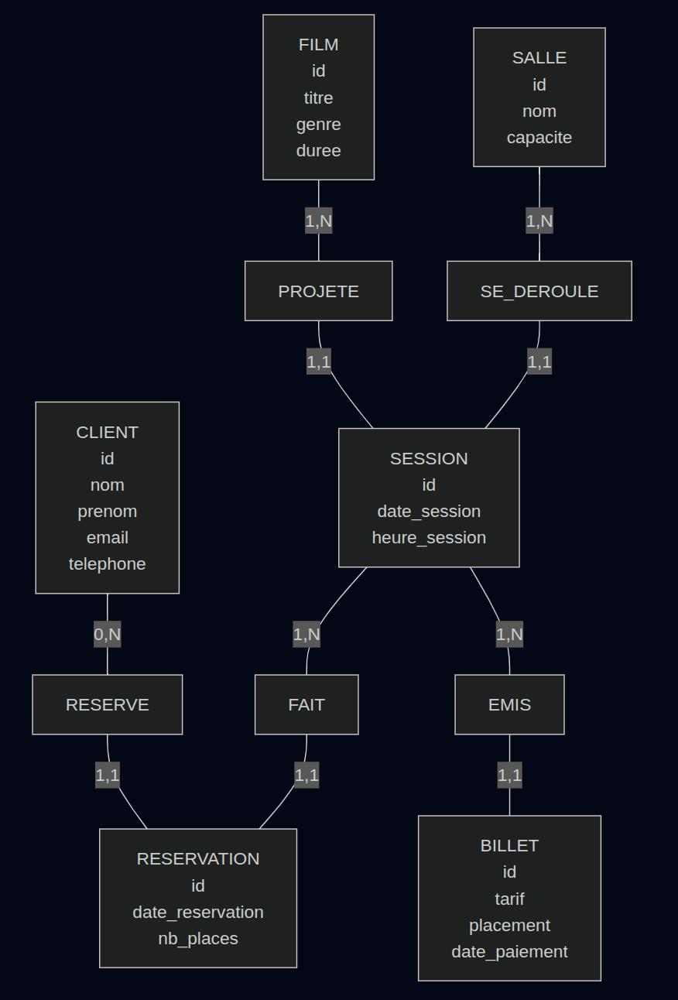
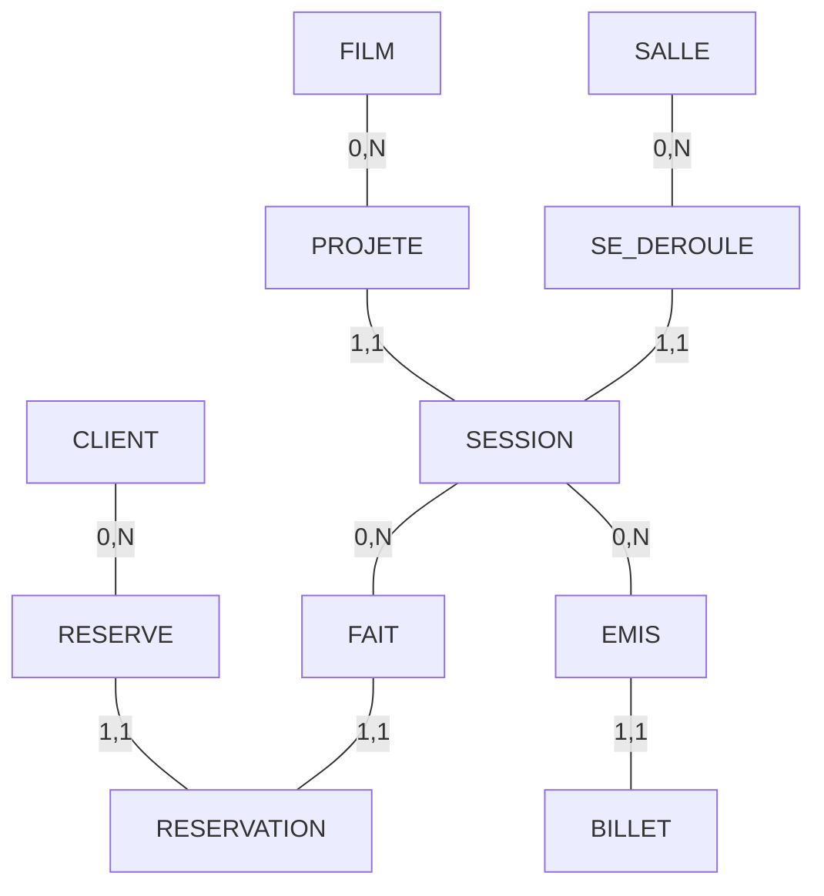

# Solution Session 4 : MCD Gestion de cinema multiplex

# **1. Analyse & Modélisation**

## **Entités principales**

* **FILM** : informations cinématographiques
* **SALLE** : salles de projection
* **SESSION** : projection (film, salle, date, heure)
* **CLIENT** : personnes effectuant des réservations
* **BILLET** : billet vendu (tarif, placement, paiement)
* **RESERVATION** : réservation d’une place avant achat

## **Associations**

* FILM —< SESSION
* SALLE —< SESSION
* SESSION —< BILLET
* CLIENT —< RESERVATION
* SESSION —< RESERVATION

## **Cardinalités**

* Un film est projeté dans 0 à N sessions
* Une salle accueille 0 à N sessions
* Une session concerne 1 film et 1 salle
* Un billet concerne 1 seule session
* Un client peut avoir 0 à N réservations
* Une réservation est pour 1 session

---

# 2. MCD

# 3. Explication des cardinalités

---

# **1. FILM — PROJETE — SESSION**

### **FILM → PROJETE : (1,N)**

* Un film peut être projeté **dans plusieurs sessions** (N).
* Un film projeté doit apparaître **au moins dans une session** (1).
  (Si un film n’est jamais projeté, il n'est pas utile de l'enregistrer.)

### **PROJETE → SESSION : (1,1)**

* Une session correspond **à la projection d’un seul film** (1).
* Chaque occurrence de PROJETE pointe donc vers **une seule session** (1).

➡️ **Conclusion :**
Un film peut être projeté plusieurs fois, mais une session projette un seul film.

---

# **2. SALLE — SE_DEROULE — SESSION**

### **SALLE → SE_DEROULE : (1,N)**

* Une salle accueille **plusieurs sessions** à des horaires différents (N).
* Une salle utilisée doit accueillir **au moins une session** (1).

### **SE_DEROULE → SESSION : (1,1)**

* Une session se déroule **dans une seule salle** (1).
* Une occurrence de l’association représente **un seul créneau dans une salle** (1).

➡️ **Conclusion :**
Une salle peut accueillir de nombreuses sessions, mais une session est toujours dans une seule salle.

---

# **3. CLIENT — RESERVE — RESERVATION**

### **CLIENT → RESERVE : (0,N)**

* Un client peut effectuer **0, 1 ou plusieurs réservations**.
* 0 est possible : un client peut être enregistré mais ne rien réserver.

### **RESERVE → RESERVATION : (1,1)**

* Une réservation est toujours faite **par un seul client** (1).
* Elle ne peut pas être anonyme ou partagée (1).

➡️ **Conclusion :**
Un client peut faire plusieurs réservations, mais chaque réservation appartient à un seul client.

---

# **4. SESSION — FAIT — RESERVATION**

### **SESSION → FAIT : (1,N)**

* Une session peut faire l’objet de **plusieurs réservations** (N).
* Une session existe pour être projetée et peut être réservée **au moins une fois** (1).
  (Dans un contexte commercial réel : une session sans réservation n’a pas de sens, mais on peut admettre 0 si nécessaire.)

### **FAIT → RESERVATION : (1,1)**

* Une réservation porte toujours sur **une seule session précise** (1).
* Une réservation ne peut concerner plusieurs projections (1).

➡️ **Conclusion :**
Une session peut recevoir plusieurs réservations, mais chaque réservation concerne une unique session.

---

# **5. SESSION — EMIS — BILLET**

### **SESSION → EMIS : (1,N)**

* Une session génère **plusieurs billets** (N).
* Chaque billet correspond **à une place vendue**.
* 1 minimum car un billet est lié à une session ; si la session n’a pas encore vendu de ticket, elle n’apparaît pas dans l’association.

### **EMIS → BILLET : (1,1)**

* Un billet appartient à **une seule session** (1).
* Un billet ne peut pas être valable pour deux projections (1).

➡️ **Conclusion :**
Une session émet plusieurs billets, mais un billet correspond à une seule session.

---

# **Résumé clair des cardinalités**

| Relation                  | Lecture                                                                                            |
| ------------------------- | -------------------------------------------------------------------------------------------------- |
| FILM (1,N) SESSION        | Un film peut avoir plusieurs sessions, mais une session projette un seul film.                     |
| SALLE (1,N) SESSION       | Une salle accueille plusieurs sessions, mais une session a une seule salle.                        |
| CLIENT (0,N) RÉSERVATION  | Un client peut faire plusieurs réservations, mais une réservation appartient à un seul client.     |
| SESSION (1,N) RÉSERVATION | Une session peut recevoir plusieurs réservations, mais une réservation concerne une seule session. |
| SESSION (1,N) BILLET      | Une session émet plusieurs billets, mais un billet appartient à une seule session.                 |

---
# Code mermaid

