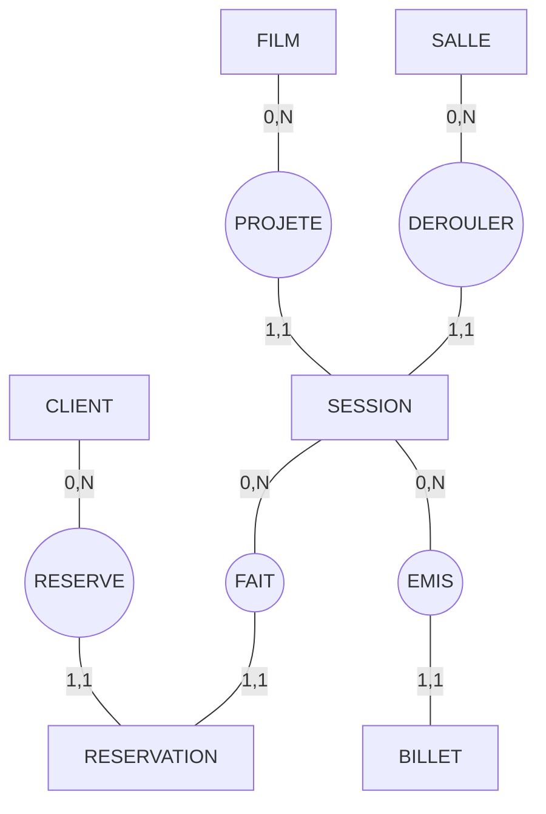

# Session 4 : MCD — Gestion de cinéma multiplex

# **1. Analyse & Modélisation**

## **Entités principales**

| Entité          | Rôle                                                    |
| --------------- | ------------------------------------------------------- |
| **FILM**        | Données cinématographiques (titre, durée, réalisateur…) |
| **SALLE**       | Salles physiques de projection                          |
| **SESSION**     | Une projection : film + salle + date/heure              |
| **CLIENT**      | Personnes pouvant réserver                              |
| **RESERVATION** | Place(s) réservée(s) avant paiement                     |
| **BILLET**      | Billet acheté pour une session                          |

---

# **Associations et cardinalités**

Tes associations deviennent :

* **FILM —(0,N)→ PROJETE —(1,1)→ SESSION**
* **SALLE —(0,N)→ SE_DEROULE —(1,1)→ SESSION**
* **CLIENT —(0,N)→ RESERVE —(1,1)→ RESERVATION**
* **SESSION —(0,N)→ FAIT —(1,1)→ RESERVATION**
* **SESSION —(0,N)→ EMIS —(1,1)→ BILLET**

---

# **2. MCD (mermaid)**

See it [live on mermaid](https://mermaid.live/edit#pako:eNqdU01vwjAM_SuVTyAVRBlQkhuDIHUqMLXdDlumKVozQFtb1LXSNuC_kw9KQw87LBc7fvaL_ZLs4S2LOWBY52y3saIZTS2x5p6_eKYgDYUXmupoOPF9IsLKmnESht5qKRHtGdjU98gyEpB2DCQgIQkeJ5GuNHZGzq0nTpLV2jGQ-2B1RyLSalE4uxTa7aqf1xkJVg--gs9uUOPziRdJRNo6qjtQJWe3xsjCCyUgrY7WOlmdTsc6UOjZovND1dhVl1WKYzsypVLJlLXBUo_QHOlvLq1yg6waxxyzQWPKf32rDS6l2UXF_7IoHS_KNlj0XYMt3uQ2BvzOPr-4DQnPEyb3sJeVFIoNTzgFLNyY5R8UaHoURTuWPmVZArjIS1GWZ-V6cyEpdzEr-GzLxHOvU3ga83yalWkBGCkGwHv4Btx3b7pufzhCAzR2Bk5vbMMP4NGo6_QHSIZcByHkHm34VUf2umN3aAOPt0WWL_THUv_reAJAs-74)

---

# **3. Explication des cardinalités**

---

## **1. FILM — PROJETE — SESSION**

### FILM → PROJETE : **(0,N)**

* Un film **peut ne pas être encore projeté** (ex : film nouvellement encodé).
* Un film peut être projeté dans **plusieurs sessions**.

### PROJETE → SESSION : **(1,1)**

* Une session projette **un seul film**.

➡️ **Conclusion** : plusieurs sessions peuvent projeter le même film, mais une session ne projette qu’un film.

---

## **2. SALLE — SE_DEROULE — SESSION**

### SALLE → SE_DEROULE : **(0,N)**

* Une salle peut être encodée sans qu’aucune session ne soit encore programmée.
* Une salle peut accueillir **N sessions**.

### SE_DEROULE → SESSION : **(1,1)**

* Une session a lieu **dans une seule salle**.

➡️ **Conclusion :** une salle peut accueillir plusieurs sessions ; une session a une salle unique.

---

## **3. CLIENT — RESERVE — RESERVATION**

### CLIENT → RESERVE : **(0,N)**

* Un client peut avoir **0 ou plusieurs réservations**.

### RESERVE → RESERVATION : **(1,1)**

* Chaque réservation appartient **à un seul client**.

➡️ **Conclusion :** plusieurs réservations possibles par client, mais toute réservation a un seul propriétaire.

---

## **4. SESSION — FAIT — RESERVATION**

### SESSION → FAIT : **(0,N)**

* Une session peut recevoir **0 à N réservations**.

### FAIT → RESERVATION : **(1,1)**

* Une réservation porte sur **une seule session**.

➡️ **Conclusion :** une session peut être réservée plusieurs fois, mais chaque réservation vise une seule session.

---

## **5. SESSION — EMIS — BILLET**

### SESSION → EMIS : **(0,N)**

* Une session peut générer **0 à N billets** (si pas encore en vente : 0).

### EMIS → BILLET : **(1,1)**

* Un billet est toujours émis pour **une seule session**.

➡️ **Conclusion :** une session émet plusieurs billets, un billet correspond à une seule session.

---

# **5. Résumé clair des cardinalités (version corrigée)**

| Relation                  | Lecture                                                      |
| ------------------------- | ------------------------------------------------------------ |
| FILM (0,N) SESSION        | Un film peut être projeté dans plusieurs sessions ou aucune. |
| SALLE (0,N) SESSION       | Une salle peut accueillir plusieurs sessions ou aucune.      |
| CLIENT (0,N) RÉSERVATION  | Un client peut faire plusieurs réservations ou aucune.       |
| SESSION (0,N) RÉSERVATION | Une session peut recevoir plusieurs réservations ou aucune.  |
| SESSION (0,N) BILLET      | Une session peut émettre plusieurs billets ou aucun.         |

---

# 🎯 **Erratum 2025-12-08**

| Élément               | Ancienne version | Nouvelle version                                                             |
| --------------------- | ---------------- | ---------------------------------------------------------------------------- |
| FILM → SESSION        | (1,N)            | (0,N)                                                                        |
| SALLE → SESSION       | (1,N)            | (0,N)                                                                        |
| SESSION → RESERVATION | (1,N)            | (0,N)                                                                        |
| SESSION → BILLET      | (1,N)            | (0,N)                                                                        |
| Justification         | “au moins 1”     | Adapté au schéma réel : sessions ou films peuvent exister avant exploitation |
