# Title: MCD gestion de consultations médicales

```
graph TD
    PATIENT[PATIENT
        id
        nom
        prenom
        date_naissance
        adresse
        telephone
        email]
        
    MEDECIN[MEDECIN
        id
        nom
        prenom
        telephone
        email]
        
    SPECIALITE[SPECIALITE
        id
        libelle
        description]
        
    CONSULTATION[CONSULTATION
        id
        date_heure
        duree
        diagnostic
        tarif
        statut]
        
    AVOIR((AVOIR))
    PATIENT --- |"0,N"| AVOIR
    AVOIR --- |"1,1"| CONSULTATION
    
    EFFECTUER((EFFECTUER))
    MEDECIN --- |"0,N"| EFFECTUER
    EFFECTUER --- |"1,1"| CONSULTATION
    
    ATTACHE((ATTACHE))
    SPECIALITE --- |"0,1"| ATTACHE
    ATTACHE --- |"1,1"| MEDECIN

    POSSEDER((POSSEDER))
    SPECIALITE --- |"1,1"| POSSEDER
    POSSEDER --- |"0,N"| MEDECIN```
```

# Justification des relations dans le MCD:

PATIENT → CONSULTATION (1,n)

Un patient peut avoir plusieurs consultations au fil du temps
Une consultation concerne obligatoirement un seul patient
Cardinalité 1,n: chaque patient a au moins une consultation


MEDECIN → CONSULTATION (1,n)

Un médecin réalise plusieurs consultations
Une consultation est effectuée par un seul médecin
Cardinalité 1,n: chaque médecin effectue au moins une consultation


SPECIALITE → MEDECIN (1,n)

Une spécialité peut être exercée par plusieurs médecins
Un médecin est rattaché à une seule spécialité (contrainte métier)
Cardinalité 1,n: chaque spécialité a au moins un médecin


# MCD:


