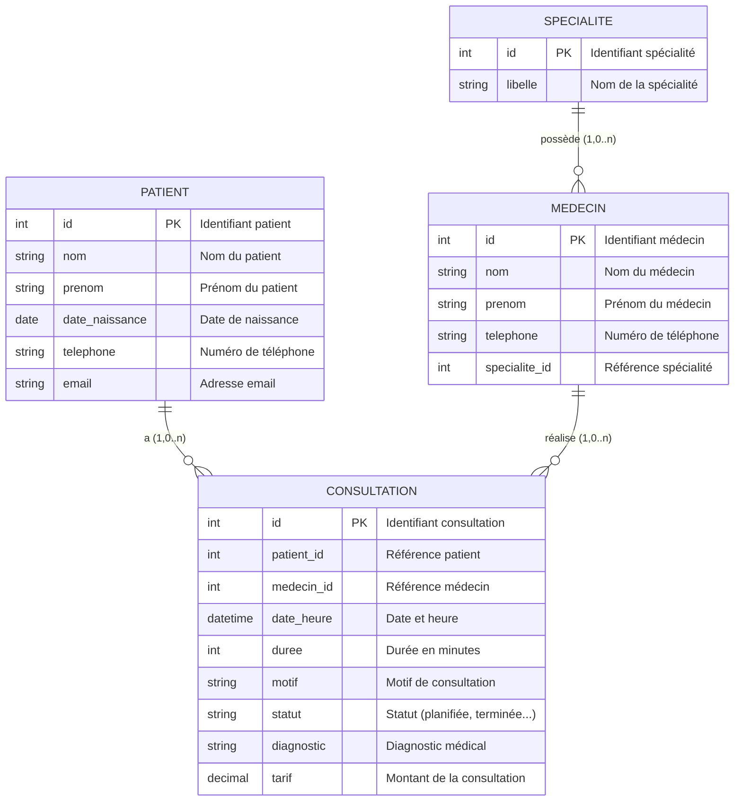
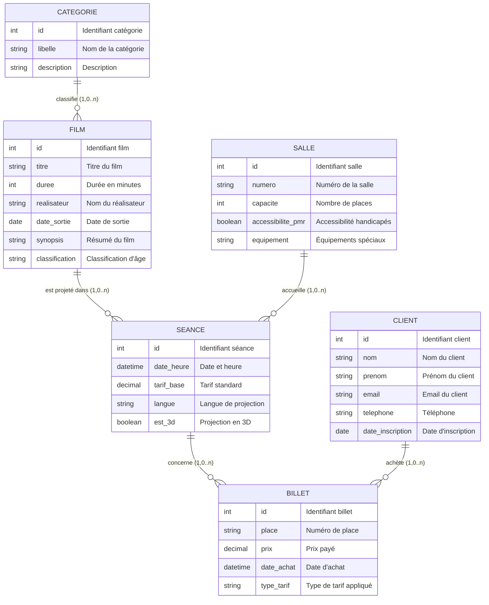

# Title: MCD gestion de consultations médicales

<svg aria-roledescription="er" role="graphics-document document" viewBox="0 0 621.841796875 669" style="max-width: 3840px; background-color: white; max-height: 3840px;" xmlns:xlink="http://www.w3.org/1999/xlink" xmlns="http://www.w3.org/2000/svg" width="100%" id="my-svg"><g/><defs><marker orient="auto" markerHeight="240" markerWidth="190" refY="7" refX="0" id="MD_PARENT_START"><path d="M 18,7 L9,13 L1,7 L9,1 Z"/></marker></defs><defs><marker orient="auto" markerHeight="28" markerWidth="20" refY="7" refX="19" id="MD_PARENT_END"><path d="M 18,7 L9,13 L1,7 L9,1 Z"/></marker></defs><defs><marker orient="auto" markerHeight="18" markerWidth="18" refY="9" refX="0" id="ONLY_ONE_START"><path d="M9,0 L9,18 M15,0 L15,18" fill="none" stroke="gray"/></marker></defs><defs><marker orient="auto" markerHeight="18" markerWidth="18" refY="9" refX="18" id="ONLY_ONE_END"><path d="M3,0 L3,18 M9,0 L9,18" fill="none" stroke="gray"/></marker></defs><defs><marker orient="auto" markerHeight="18" markerWidth="30" refY="9" refX="0" id="ZERO_OR_ONE_START"><circle r="6" cy="9" cx="21" fill="white" stroke="gray"/><path d="M9,0 L9,18" fill="none" stroke="gray"/></marker></defs><defs><marker orient="auto" markerHeight="18" markerWidth="30" refY="9" refX="30" id="ZERO_OR_ONE_END"><circle r="6" cy="9" cx="9" fill="white" stroke="gray"/><path d="M21,0 L21,18" fill="none" stroke="gray"/></marker></defs><defs><marker orient="auto" markerHeight="36" markerWidth="45" refY="18" refX="18" id="ONE_OR_MORE_START"><path d="M0,18 Q 18,0 36,18 Q 18,36 0,18 M42,9 L42,27" fill="none" stroke="gray"/></marker></defs><defs><marker orient="auto" markerHeight="36" markerWidth="45" refY="18" refX="27" id="ONE_OR_MORE_END"><path d="M3,9 L3,27 M9,18 Q27,0 45,18 Q27,36 9,18" fill="none" stroke="gray"/></marker></defs><defs><marker orient="auto" markerHeight="36" markerWidth="57" refY="18" refX="18" id="ZERO_OR_MORE_START"><circle r="6" cy="18" cx="48" fill="white" stroke="gray"/><path d="M0,18 Q18,0 36,18 Q18,36 0,18" fill="none" stroke="gray"/></marker></defs><defs><marker orient="auto" markerHeight="36" markerWidth="57" refY="18" refX="39" id="ZERO_OR_MORE_END"><circle r="6" cy="18" cx="9" fill="white" stroke="gray"/><path d="M21,18 Q39,0 57,18 Q39,36 21,18" fill="none" stroke="gray"/></marker></defs><path style="stroke: gray; fill: none;" marker-start="url(#ONLY_ONE_START)" marker-end="url(#ZERO_OR_MORE_END)" d="M144.366,336L144.366,344.333C144.366,352.667,144.366,369.333,153.443,386C162.52,402.667,180.673,419.333,189.75,427.667L198.826,436" class="er relationshipLine"/><path style="stroke: gray; fill: none;" marker-start="url(#ONLY_ONE_START)" marker-end="url(#ZERO_OR_MORE_END)" d="M485.287,325.5L485.287,335.583C485.287,345.667,485.287,365.833,476.21,384.25C467.134,402.667,448.98,419.333,439.904,427.667L430.827,436" class="er relationshipLine"/><path style="stroke: gray; fill: none;" marker-start="url(#ONLY_ONE_START)" marker-end="url(#ZERO_OR_MORE_END)" d="M485.287,86L485.287,94.333C485.287,102.667,485.287,119.333,485.287,137.75C485.287,156.167,485.287,176.333,485.287,186.417L485.287,196.5" class="er relationshipLine"/><g transform="translate(20,186 )" id="entity-PATIENT-1d5528e4-b873-5fa2-b03f-2264906c1060"><rect height="150" width="248.7325439453125" y="0" x="0" class="er entityBox"/><text style="dominant-baseline: middle; text-anchor: middle; font-size: 12px;" transform="translate(124.36627197265625,12)" y="0" x="0" id="text-entity-PATIENT-1d5528e4-b873-5fa2-b03f-2264906c1060" class="er entityLabel">PATIENT</text><rect height="21" width="34.921875" y="24" x="0" class="er attributeBoxOdd"/><text style="dominant-baseline: middle; font-size: 10.2px;" transform="translate(5,34.5)" y="0" x="0" id="text-entity-PATIENT-1d5528e4-b873-5fa2-b03f-2264906c1060-attr-1-type" class="er entityLabel">int</text><rect height="21" width="81.701416015625" y="24" x="34.921875" class="er attributeBoxOdd"/><text style="dominant-baseline: middle; font-size: 10.2px;" transform="translate(39.921875,34.5)" y="0" x="0" id="text-entity-PATIENT-1d5528e4-b873-5fa2-b03f-2264906c1060-attr-1-name" class="er entityLabel">id</text><rect height="21" width="23.79498291015625" y="24" x="116.623291015625" class="er attributeBoxOdd"/><text style="dominant-baseline: middle; font-size: 10.2px;" transform="translate(121.623291015625,34.5)" y="0" x="0" id="text-entity-PATIENT-1d5528e4-b873-5fa2-b03f-2264906c1060-attr-1-key" class="er entityLabel">PK</text><rect height="21" width="108.31427001953125" y="24" x="140.41827392578125" class="er attributeBoxOdd"/><text style="dominant-baseline: middle; font-size: 10.2px;" transform="translate(145.41827392578125,34.5)" y="0" x="0" id="text-entity-PATIENT-1d5528e4-b873-5fa2-b03f-2264906c1060-attr-1-comment" class="er entityLabel">Identifiant patient</text><rect height="21" width="34.921875" y="45" x="0" class="er attributeBoxEven"/><text style="dominant-baseline: middle; font-size: 10.2px;" transform="translate(5,55.5)" y="0" x="0" id="text-entity-PATIENT-1d5528e4-b873-5fa2-b03f-2264906c1060-attr-2-type" class="er entityLabel">string</text><rect height="21" width="81.701416015625" y="45" x="34.921875" class="er attributeBoxEven"/><text style="dominant-baseline: middle; font-size: 10.2px;" transform="translate(39.921875,55.5)" y="0" x="0" id="text-entity-PATIENT-1d5528e4-b873-5fa2-b03f-2264906c1060-attr-2-name" class="er entityLabel">nom</text><rect height="21" width="23.79498291015625" y="45" x="116.623291015625" class="er attributeBoxEven"/><text style="dominant-baseline: middle; font-size: 10.2px;" transform="translate(121.623291015625,55.5)" y="0" x="0" id="text-entity-PATIENT-1d5528e4-b873-5fa2-b03f-2264906c1060-attr-2-key" class="er entityLabel"/><rect height="21" width="108.31427001953125" y="45" x="140.41827392578125" class="er attributeBoxEven"/><text style="dominant-baseline: middle; font-size: 10.2px;" transform="translate(145.41827392578125,55.5)" y="0" x="0" id="text-entity-PATIENT-1d5528e4-b873-5fa2-b03f-2264906c1060-attr-2-comment" class="er entityLabel">Nom du patient</text><rect height="21" width="34.921875" y="66" x="0" class="er attributeBoxOdd"/><text style="dominant-baseline: middle; font-size: 10.2px;" transform="translate(5,76.5)" y="0" x="0" id="text-entity-PATIENT-1d5528e4-b873-5fa2-b03f-2264906c1060-attr-3-type" class="er entityLabel">string</text><rect height="21" width="81.701416015625" y="66" x="34.921875" class="er attributeBoxOdd"/><text style="dominant-baseline: middle; font-size: 10.2px;" transform="translate(39.921875,76.5)" y="0" x="0" id="text-entity-PATIENT-1d5528e4-b873-5fa2-b03f-2264906c1060-attr-3-name" class="er entityLabel">prenom</text><rect height="21" width="23.79498291015625" y="66" x="116.623291015625" class="er attributeBoxOdd"/><text style="dominant-baseline: middle; font-size: 10.2px;" transform="translate(121.623291015625,76.5)" y="0" x="0" id="text-entity-PATIENT-1d5528e4-b873-5fa2-b03f-2264906c1060-attr-3-key" class="er entityLabel"/><rect height="21" width="108.31427001953125" y="66" x="140.41827392578125" class="er attributeBoxOdd"/><text style="dominant-baseline: middle; font-size: 10.2px;" transform="translate(145.41827392578125,76.5)" y="0" x="0" id="text-entity-PATIENT-1d5528e4-b873-5fa2-b03f-2264906c1060-attr-3-comment" class="er entityLabel">Prénom du patient</text><rect height="21" width="34.921875" y="87" x="0" class="er attributeBoxEven"/><text style="dominant-baseline: middle; font-size: 10.2px;" transform="translate(5,97.5)" y="0" x="0" id="text-entity-PATIENT-1d5528e4-b873-5fa2-b03f-2264906c1060-attr-4-type" class="er entityLabel">date</text><rect height="21" width="81.701416015625" y="87" x="34.921875" class="er attributeBoxEven"/><text style="dominant-baseline: middle; font-size: 10.2px;" transform="translate(39.921875,97.5)" y="0" x="0" id="text-entity-PATIENT-1d5528e4-b873-5fa2-b03f-2264906c1060-attr-4-name" class="er entityLabel">date_naissance</text><rect height="21" width="23.79498291015625" y="87" x="116.623291015625" class="er attributeBoxEven"/><text style="dominant-baseline: middle; font-size: 10.2px;" transform="translate(121.623291015625,97.5)" y="0" x="0" id="text-entity-PATIENT-1d5528e4-b873-5fa2-b03f-2264906c1060-attr-4-key" class="er entityLabel"/><rect height="21" width="108.31427001953125" y="87" x="140.41827392578125" class="er attributeBoxEven"/><text style="dominant-baseline: middle; font-size: 10.2px;" transform="translate(145.41827392578125,97.5)" y="0" x="0" id="text-entity-PATIENT-1d5528e4-b873-5fa2-b03f-2264906c1060-attr-4-comment" class="er entityLabel">Date de naissance</text><rect height="21" width="34.921875" y="108" x="0" class="er attributeBoxOdd"/><text style="dominant-baseline: middle; font-size: 10.2px;" transform="translate(5,118.5)" y="0" x="0" id="text-entity-PATIENT-1d5528e4-b873-5fa2-b03f-2264906c1060-attr-5-type" class="er entityLabel">string</text><rect height="21" width="81.701416015625" y="108" x="34.921875" class="er attributeBoxOdd"/><text style="dominant-baseline: middle; font-size: 10.2px;" transform="translate(39.921875,118.5)" y="0" x="0" id="text-entity-PATIENT-1d5528e4-b873-5fa2-b03f-2264906c1060-attr-5-name" class="er entityLabel">telephone</text><rect height="21" width="23.79498291015625" y="108" x="116.623291015625" class="er attributeBoxOdd"/><text style="dominant-baseline: middle; font-size: 10.2px;" transform="translate(121.623291015625,118.5)" y="0" x="0" id="text-entity-PATIENT-1d5528e4-b873-5fa2-b03f-2264906c1060-attr-5-key" class="er entityLabel"/><rect height="21" width="108.31427001953125" y="108" x="140.41827392578125" class="er attributeBoxOdd"/><text style="dominant-baseline: middle; font-size: 10.2px;" transform="translate(145.41827392578125,118.5)" y="0" x="0" id="text-entity-PATIENT-1d5528e4-b873-5fa2-b03f-2264906c1060-attr-5-comment" class="er entityLabel">Numéro de téléphone</text><rect height="21" width="34.921875" y="129" x="0" class="er attributeBoxEven"/><text style="dominant-baseline: middle; font-size: 10.2px;" transform="translate(5,139.5)" y="0" x="0" id="text-entity-PATIENT-1d5528e4-b873-5fa2-b03f-2264906c1060-attr-6-type" class="er entityLabel">string</text><rect height="21" width="81.701416015625" y="129" x="34.921875" class="er attributeBoxEven"/><text style="dominant-baseline: middle; font-size: 10.2px;" transform="translate(39.921875,139.5)" y="0" x="0" id="text-entity-PATIENT-1d5528e4-b873-5fa2-b03f-2264906c1060-attr-6-name" class="er entityLabel">email</text><rect height="21" width="23.79498291015625" y="129" x="116.623291015625" class="er attributeBoxEven"/><text style="dominant-baseline: middle; font-size: 10.2px;" transform="translate(121.623291015625,139.5)" y="0" x="0" id="text-entity-PATIENT-1d5528e4-b873-5fa2-b03f-2264906c1060-attr-6-key" class="er entityLabel"/><rect height="21" width="108.31427001953125" y="129" x="140.41827392578125" class="er attributeBoxEven"/><text style="dominant-baseline: middle; font-size: 10.2px;" transform="translate(145.41827392578125,139.5)" y="0" x="0" id="text-entity-PATIENT-1d5528e4-b873-5fa2-b03f-2264906c1060-attr-6-comment" class="er entityLabel">Adresse email</text></g><g transform="translate(177.88162231445312,436 )" id="entity-CONSULTATION-196fbdbb-d042-5722-9f4a-0924f09a608c"><rect height="213" width="273.89019775390625" y="0" x="0" class="er entityBox"/><text style="dominant-baseline: middle; text-anchor: middle; font-size: 12px;" transform="translate(136.94509887695312,12)" y="0" x="0" id="text-entity-CONSULTATION-196fbdbb-d042-5722-9f4a-0924f09a608c" class="er entityLabel">CONSULTATION</text><rect height="21" width="49.4078369140625" y="24" x="0" class="er attributeBoxOdd"/><text style="dominant-baseline: middle; font-size: 10.2px;" transform="translate(5,34.5)" y="0" x="0" id="text-entity-CONSULTATION-196fbdbb-d042-5722-9f4a-0924f09a608c-attr-1-type" class="er entityLabel">int</text><rect height="21" width="62.109375" y="24" x="49.4078369140625" class="er attributeBoxOdd"/><text style="dominant-baseline: middle; font-size: 10.2px;" transform="translate(54.4078369140625,34.5)" y="0" x="0" id="text-entity-CONSULTATION-196fbdbb-d042-5722-9f4a-0924f09a608c-attr-1-name" class="er entityLabel">id</text><rect height="21" width="23.79498291015625" y="24" x="111.5172119140625" class="er attributeBoxOdd"/><text style="dominant-baseline: middle; font-size: 10.2px;" transform="translate(116.5172119140625,34.5)" y="0" x="0" id="text-entity-CONSULTATION-196fbdbb-d042-5722-9f4a-0924f09a608c-attr-1-key" class="er entityLabel">PK</text><rect height="21" width="138.5780029296875" y="24" x="135.31219482421875" class="er attributeBoxOdd"/><text style="dominant-baseline: middle; font-size: 10.2px;" transform="translate(140.31219482421875,34.5)" y="0" x="0" id="text-entity-CONSULTATION-196fbdbb-d042-5722-9f4a-0924f09a608c-attr-1-comment" class="er entityLabel">Identifiant consultation</text><rect height="21" width="49.4078369140625" y="45" x="0" class="er attributeBoxEven"/><text style="dominant-baseline: middle; font-size: 10.2px;" transform="translate(5,55.5)" y="0" x="0" id="text-entity-CONSULTATION-196fbdbb-d042-5722-9f4a-0924f09a608c-attr-2-type" class="er entityLabel">int</text><rect height="21" width="62.109375" y="45" x="49.4078369140625" class="er attributeBoxEven"/><text style="dominant-baseline: middle; font-size: 10.2px;" transform="translate(54.4078369140625,55.5)" y="0" x="0" id="text-entity-CONSULTATION-196fbdbb-d042-5722-9f4a-0924f09a608c-attr-2-name" class="er entityLabel">patient_id</text><rect height="21" width="23.79498291015625" y="45" x="111.5172119140625" class="er attributeBoxEven"/><text style="dominant-baseline: middle; font-size: 10.2px;" transform="translate(116.5172119140625,55.5)" y="0" x="0" id="text-entity-CONSULTATION-196fbdbb-d042-5722-9f4a-0924f09a608c-attr-2-key" class="er entityLabel"/><rect height="21" width="138.5780029296875" y="45" x="135.31219482421875" class="er attributeBoxEven"/><text style="dominant-baseline: middle; font-size: 10.2px;" transform="translate(140.31219482421875,55.5)" y="0" x="0" id="text-entity-CONSULTATION-196fbdbb-d042-5722-9f4a-0924f09a608c-attr-2-comment" class="er entityLabel">Référence patient</text><rect height="21" width="49.4078369140625" y="66" x="0" class="er attributeBoxOdd"/><text style="dominant-baseline: middle; font-size: 10.2px;" transform="translate(5,76.5)" y="0" x="0" id="text-entity-CONSULTATION-196fbdbb-d042-5722-9f4a-0924f09a608c-attr-3-type" class="er entityLabel">int</text><rect height="21" width="62.109375" y="66" x="49.4078369140625" class="er attributeBoxOdd"/><text style="dominant-baseline: middle; font-size: 10.2px;" transform="translate(54.4078369140625,76.5)" y="0" x="0" id="text-entity-CONSULTATION-196fbdbb-d042-5722-9f4a-0924f09a608c-attr-3-name" class="er entityLabel">medecin_id</text><rect height="21" width="23.79498291015625" y="66" x="111.5172119140625" class="er attributeBoxOdd"/><text style="dominant-baseline: middle; font-size: 10.2px;" transform="translate(116.5172119140625,76.5)" y="0" x="0" id="text-entity-CONSULTATION-196fbdbb-d042-5722-9f4a-0924f09a608c-attr-3-key" class="er entityLabel"/><rect height="21" width="138.5780029296875" y="66" x="135.31219482421875" class="er attributeBoxOdd"/><text style="dominant-baseline: middle; font-size: 10.2px;" transform="translate(140.31219482421875,76.5)" y="0" x="0" id="text-entity-CONSULTATION-196fbdbb-d042-5722-9f4a-0924f09a608c-attr-3-comment" class="er entityLabel">Référence médecin</text><rect height="21" width="49.4078369140625" y="87" x="0" class="er attributeBoxEven"/><text style="dominant-baseline: middle; font-size: 10.2px;" transform="translate(5,97.5)" y="0" x="0" id="text-entity-CONSULTATION-196fbdbb-d042-5722-9f4a-0924f09a608c-attr-4-type" class="er entityLabel">datetime</text><rect height="21" width="62.109375" y="87" x="49.4078369140625" class="er attributeBoxEven"/><text style="dominant-baseline: middle; font-size: 10.2px;" transform="translate(54.4078369140625,97.5)" y="0" x="0" id="text-entity-CONSULTATION-196fbdbb-d042-5722-9f4a-0924f09a608c-attr-4-name" class="er entityLabel">date_heure</text><rect height="21" width="23.79498291015625" y="87" x="111.5172119140625" class="er attributeBoxEven"/><text style="dominant-baseline: middle; font-size: 10.2px;" transform="translate(116.5172119140625,97.5)" y="0" x="0" id="text-entity-CONSULTATION-196fbdbb-d042-5722-9f4a-0924f09a608c-attr-4-key" class="er entityLabel"/><rect height="21" width="138.5780029296875" y="87" x="135.31219482421875" class="er attributeBoxEven"/><text style="dominant-baseline: middle; font-size: 10.2px;" transform="translate(140.31219482421875,97.5)" y="0" x="0" id="text-entity-CONSULTATION-196fbdbb-d042-5722-9f4a-0924f09a608c-attr-4-comment" class="er entityLabel">Date et heure</text><rect height="21" width="49.4078369140625" y="108" x="0" class="er attributeBoxOdd"/><text style="dominant-baseline: middle; font-size: 10.2px;" transform="translate(5,118.5)" y="0" x="0" id="text-entity-CONSULTATION-196fbdbb-d042-5722-9f4a-0924f09a608c-attr-5-type" class="er entityLabel">int</text><rect height="21" width="62.109375" y="108" x="49.4078369140625" class="er attributeBoxOdd"/><text style="dominant-baseline: middle; font-size: 10.2px;" transform="translate(54.4078369140625,118.5)" y="0" x="0" id="text-entity-CONSULTATION-196fbdbb-d042-5722-9f4a-0924f09a608c-attr-5-name" class="er entityLabel">duree</text><rect height="21" width="23.79498291015625" y="108" x="111.5172119140625" class="er attributeBoxOdd"/><text style="dominant-baseline: middle; font-size: 10.2px;" transform="translate(116.5172119140625,118.5)" y="0" x="0" id="text-entity-CONSULTATION-196fbdbb-d042-5722-9f4a-0924f09a608c-attr-5-key" class="er entityLabel"/><rect height="21" width="138.5780029296875" y="108" x="135.31219482421875" class="er attributeBoxOdd"/><text style="dominant-baseline: middle; font-size: 10.2px;" transform="translate(140.31219482421875,118.5)" y="0" x="0" id="text-entity-CONSULTATION-196fbdbb-d042-5722-9f4a-0924f09a608c-attr-5-comment" class="er entityLabel">Durée en minutes</text><rect height="21" width="49.4078369140625" y="129" x="0" class="er attributeBoxEven"/><text style="dominant-baseline: middle; font-size: 10.2px;" transform="translate(5,139.5)" y="0" x="0" id="text-entity-CONSULTATION-196fbdbb-d042-5722-9f4a-0924f09a608c-attr-6-type" class="er entityLabel">string</text><rect height="21" width="62.109375" y="129" x="49.4078369140625" class="er attributeBoxEven"/><text style="dominant-baseline: middle; font-size: 10.2px;" transform="translate(54.4078369140625,139.5)" y="0" x="0" id="text-entity-CONSULTATION-196fbdbb-d042-5722-9f4a-0924f09a608c-attr-6-name" class="er entityLabel">motif</text><rect height="21" width="23.79498291015625" y="129" x="111.5172119140625" class="er attributeBoxEven"/><text style="dominant-baseline: middle; font-size: 10.2px;" transform="translate(116.5172119140625,139.5)" y="0" x="0" id="text-entity-CONSULTATION-196fbdbb-d042-5722-9f4a-0924f09a608c-attr-6-key" class="er entityLabel"/><rect height="21" width="138.5780029296875" y="129" x="135.31219482421875" class="er attributeBoxEven"/><text style="dominant-baseline: middle; font-size: 10.2px;" transform="translate(140.31219482421875,139.5)" y="0" x="0" id="text-entity-CONSULTATION-196fbdbb-d042-5722-9f4a-0924f09a608c-attr-6-comment" class="er entityLabel">Motif de consultation</text><rect height="21" width="49.4078369140625" y="150" x="0" class="er attributeBoxOdd"/><text style="dominant-baseline: middle; font-size: 10.2px;" transform="translate(5,160.5)" y="0" x="0" id="text-entity-CONSULTATION-196fbdbb-d042-5722-9f4a-0924f09a608c-attr-7-type" class="er entityLabel">string</text><rect height="21" width="62.109375" y="150" x="49.4078369140625" class="er attributeBoxOdd"/><text style="dominant-baseline: middle; font-size: 10.2px;" transform="translate(54.4078369140625,160.5)" y="0" x="0" id="text-entity-CONSULTATION-196fbdbb-d042-5722-9f4a-0924f09a608c-attr-7-name" class="er entityLabel">statut</text><rect height="21" width="23.79498291015625" y="150" x="111.5172119140625" class="er attributeBoxOdd"/><text style="dominant-baseline: middle; font-size: 10.2px;" transform="translate(116.5172119140625,160.5)" y="0" x="0" id="text-entity-CONSULTATION-196fbdbb-d042-5722-9f4a-0924f09a608c-attr-7-key" class="er entityLabel"/><rect height="21" width="138.5780029296875" y="150" x="135.31219482421875" class="er attributeBoxOdd"/><text style="dominant-baseline: middle; font-size: 10.2px;" transform="translate(140.31219482421875,160.5)" y="0" x="0" id="text-entity-CONSULTATION-196fbdbb-d042-5722-9f4a-0924f09a608c-attr-7-comment" class="er entityLabel">Statut (planifiée, terminée...)</text><rect height="21" width="49.4078369140625" y="171" x="0" class="er attributeBoxEven"/><text style="dominant-baseline: middle; font-size: 10.2px;" transform="translate(5,181.5)" y="0" x="0" id="text-entity-CONSULTATION-196fbdbb-d042-5722-9f4a-0924f09a608c-attr-8-type" class="er entityLabel">string</text><rect height="21" width="62.109375" y="171" x="49.4078369140625" class="er attributeBoxEven"/><text style="dominant-baseline: middle; font-size: 10.2px;" transform="translate(54.4078369140625,181.5)" y="0" x="0" id="text-entity-CONSULTATION-196fbdbb-d042-5722-9f4a-0924f09a608c-attr-8-name" class="er entityLabel">diagnostic</text><rect height="21" width="23.79498291015625" y="171" x="111.5172119140625" class="er attributeBoxEven"/><text style="dominant-baseline: middle; font-size: 10.2px;" transform="translate(116.5172119140625,181.5)" y="0" x="0" id="text-entity-CONSULTATION-196fbdbb-d042-5722-9f4a-0924f09a608c-attr-8-key" class="er entityLabel"/><rect height="21" width="138.5780029296875" y="171" x="135.31219482421875" class="er attributeBoxEven"/><text style="dominant-baseline: middle; font-size: 10.2px;" transform="translate(140.31219482421875,181.5)" y="0" x="0" id="text-entity-CONSULTATION-196fbdbb-d042-5722-9f4a-0924f09a608c-attr-8-comment" class="er entityLabel">Diagnostic médical</text><rect height="21" width="49.4078369140625" y="192" x="0" class="er attributeBoxOdd"/><text style="dominant-baseline: middle; font-size: 10.2px;" transform="translate(5,202.5)" y="0" x="0" id="text-entity-CONSULTATION-196fbdbb-d042-5722-9f4a-0924f09a608c-attr-9-type" class="er entityLabel">decimal</text><rect height="21" width="62.109375" y="192" x="49.4078369140625" class="er attributeBoxOdd"/><text style="dominant-baseline: middle; font-size: 10.2px;" transform="translate(54.4078369140625,202.5)" y="0" x="0" id="text-entity-CONSULTATION-196fbdbb-d042-5722-9f4a-0924f09a608c-attr-9-name" class="er entityLabel">tarif</text><rect height="21" width="23.79498291015625" y="192" x="111.5172119140625" class="er attributeBoxOdd"/><text style="dominant-baseline: middle; font-size: 10.2px;" transform="translate(116.5172119140625,202.5)" y="0" x="0" id="text-entity-CONSULTATION-196fbdbb-d042-5722-9f4a-0924f09a608c-attr-9-key" class="er entityLabel"/><rect height="21" width="138.5780029296875" y="192" x="135.31219482421875" class="er attributeBoxOdd"/><text style="dominant-baseline: middle; font-size: 10.2px;" transform="translate(140.31219482421875,202.5)" y="0" x="0" id="text-entity-CONSULTATION-196fbdbb-d042-5722-9f4a-0924f09a608c-attr-9-comment" class="er entityLabel">Montant de la consultation</text></g><g transform="translate(368.7325439453125,196.5 )" id="entity-MEDECIN-ae86487c-cdbd-5827-99fd-1d305902575f"><rect height="129" width="233.1092529296875" y="0" x="0" class="er entityBox"/><text style="dominant-baseline: middle; text-anchor: middle; font-size: 12px;" transform="translate(116.55462646484375,12)" y="0" x="0" id="text-entity-MEDECIN-ae86487c-cdbd-5827-99fd-1d305902575f" class="er entityLabel">MEDECIN</text><rect height="21" width="34.921875" y="24" x="0" class="er attributeBoxOdd"/><text style="dominant-baseline: middle; font-size: 10.2px;" transform="translate(5,34.5)" y="0" x="0" id="text-entity-MEDECIN-ae86487c-cdbd-5827-99fd-1d305902575f-attr-1-type" class="er entityLabel">int</text><rect height="21" width="66.078125" y="24" x="34.921875" class="er attributeBoxOdd"/><text style="dominant-baseline: middle; font-size: 10.2px;" transform="translate(39.921875,34.5)" y="0" x="0" id="text-entity-MEDECIN-ae86487c-cdbd-5827-99fd-1d305902575f-attr-1-name" class="er entityLabel">id</text><rect height="21" width="23.79498291015625" y="24" x="101" class="er attributeBoxOdd"/><text style="dominant-baseline: middle; font-size: 10.2px;" transform="translate(106,34.5)" y="0" x="0" id="text-entity-MEDECIN-ae86487c-cdbd-5827-99fd-1d305902575f-attr-1-key" class="er entityLabel">PK</text><rect height="21" width="108.31427001953125" y="24" x="124.79498291015625" class="er attributeBoxOdd"/><text style="dominant-baseline: middle; font-size: 10.2px;" transform="translate(129.79498291015625,34.5)" y="0" x="0" id="text-entity-MEDECIN-ae86487c-cdbd-5827-99fd-1d305902575f-attr-1-comment" class="er entityLabel">Identifiant médecin</text><rect height="21" width="34.921875" y="45" x="0" class="er attributeBoxEven"/><text style="dominant-baseline: middle; font-size: 10.2px;" transform="translate(5,55.5)" y="0" x="0" id="text-entity-MEDECIN-ae86487c-cdbd-5827-99fd-1d305902575f-attr-2-type" class="er entityLabel">string</text><rect height="21" width="66.078125" y="45" x="34.921875" class="er attributeBoxEven"/><text style="dominant-baseline: middle; font-size: 10.2px;" transform="translate(39.921875,55.5)" y="0" x="0" id="text-entity-MEDECIN-ae86487c-cdbd-5827-99fd-1d305902575f-attr-2-name" class="er entityLabel">nom</text><rect height="21" width="23.79498291015625" y="45" x="101" class="er attributeBoxEven"/><text style="dominant-baseline: middle; font-size: 10.2px;" transform="translate(106,55.5)" y="0" x="0" id="text-entity-MEDECIN-ae86487c-cdbd-5827-99fd-1d305902575f-attr-2-key" class="er entityLabel"/><rect height="21" width="108.31427001953125" y="45" x="124.79498291015625" class="er attributeBoxEven"/><text style="dominant-baseline: middle; font-size: 10.2px;" transform="translate(129.79498291015625,55.5)" y="0" x="0" id="text-entity-MEDECIN-ae86487c-cdbd-5827-99fd-1d305902575f-attr-2-comment" class="er entityLabel">Nom du médecin</text><rect height="21" width="34.921875" y="66" x="0" class="er attributeBoxOdd"/><text style="dominant-baseline: middle; font-size: 10.2px;" transform="translate(5,76.5)" y="0" x="0" id="text-entity-MEDECIN-ae86487c-cdbd-5827-99fd-1d305902575f-attr-3-type" class="er entityLabel">string</text><rect height="21" width="66.078125" y="66" x="34.921875" class="er attributeBoxOdd"/><text style="dominant-baseline: middle; font-size: 10.2px;" transform="translate(39.921875,76.5)" y="0" x="0" id="text-entity-MEDECIN-ae86487c-cdbd-5827-99fd-1d305902575f-attr-3-name" class="er entityLabel">prenom</text><rect height="21" width="23.79498291015625" y="66" x="101" class="er attributeBoxOdd"/><text style="dominant-baseline: middle; font-size: 10.2px;" transform="translate(106,76.5)" y="0" x="0" id="text-entity-MEDECIN-ae86487c-cdbd-5827-99fd-1d305902575f-attr-3-key" class="er entityLabel"/><rect height="21" width="108.31427001953125" y="66" x="124.79498291015625" class="er attributeBoxOdd"/><text style="dominant-baseline: middle; font-size: 10.2px;" transform="translate(129.79498291015625,76.5)" y="0" x="0" id="text-entity-MEDECIN-ae86487c-cdbd-5827-99fd-1d305902575f-attr-3-comment" class="er entityLabel">Prénom du médecin</text><rect height="21" width="34.921875" y="87" x="0" class="er attributeBoxEven"/><text style="dominant-baseline: middle; font-size: 10.2px;" transform="translate(5,97.5)" y="0" x="0" id="text-entity-MEDECIN-ae86487c-cdbd-5827-99fd-1d305902575f-attr-4-type" class="er entityLabel">string</text><rect height="21" width="66.078125" y="87" x="34.921875" class="er attributeBoxEven"/><text style="dominant-baseline: middle; font-size: 10.2px;" transform="translate(39.921875,97.5)" y="0" x="0" id="text-entity-MEDECIN-ae86487c-cdbd-5827-99fd-1d305902575f-attr-4-name" class="er entityLabel">telephone</text><rect height="21" width="23.79498291015625" y="87" x="101" class="er attributeBoxEven"/><text style="dominant-baseline: middle; font-size: 10.2px;" transform="translate(106,97.5)" y="0" x="0" id="text-entity-MEDECIN-ae86487c-cdbd-5827-99fd-1d305902575f-attr-4-key" class="er entityLabel"/><rect height="21" width="108.31427001953125" y="87" x="124.79498291015625" class="er attributeBoxEven"/><text style="dominant-baseline: middle; font-size: 10.2px;" transform="translate(129.79498291015625,97.5)" y="0" x="0" id="text-entity-MEDECIN-ae86487c-cdbd-5827-99fd-1d305902575f-attr-4-comment" class="er entityLabel">Numéro de téléphone</text><rect height="21" width="34.921875" y="108" x="0" class="er attributeBoxOdd"/><text style="dominant-baseline: middle; font-size: 10.2px;" transform="translate(5,118.5)" y="0" x="0" id="text-entity-MEDECIN-ae86487c-cdbd-5827-99fd-1d305902575f-attr-5-type" class="er entityLabel">int</text><rect height="21" width="66.078125" y="108" x="34.921875" class="er attributeBoxOdd"/><text style="dominant-baseline: middle; font-size: 10.2px;" transform="translate(39.921875,118.5)" y="0" x="0" id="text-entity-MEDECIN-ae86487c-cdbd-5827-99fd-1d305902575f-attr-5-name" class="er entityLabel">specialite_id</text><rect height="21" width="23.79498291015625" y="108" x="101" class="er attributeBoxOdd"/><text style="dominant-baseline: middle; font-size: 10.2px;" transform="translate(106,118.5)" y="0" x="0" id="text-entity-MEDECIN-ae86487c-cdbd-5827-99fd-1d305902575f-attr-5-key" class="er entityLabel"/><rect height="21" width="108.31427001953125" y="108" x="124.79498291015625" class="er attributeBoxOdd"/><text style="dominant-baseline: middle; font-size: 10.2px;" transform="translate(129.79498291015625,118.5)" y="0" x="0" id="text-entity-MEDECIN-ae86487c-cdbd-5827-99fd-1d305902575f-attr-5-comment" class="er entityLabel">Référence spécialité</text></g><g transform="translate(386.7030334472656,20 )" id="entity-SPECIALITE-d9874d9f-ba31-5f9f-8639-0574a8e574e6"><rect height="66" width="197.16827392578125" y="0" x="0" class="er entityBox"/><text style="dominant-baseline: middle; text-anchor: middle; font-size: 12px;" transform="translate(98.58413696289062,12)" y="0" x="0" id="text-entity-SPECIALITE-d9874d9f-ba31-5f9f-8639-0574a8e574e6" class="er entityLabel">SPECIALITE</text><rect height="21" width="34.921875" y="24" x="0" class="er attributeBoxOdd"/><text style="dominant-baseline: middle; font-size: 10.2px;" transform="translate(5,34.5)" y="0" x="0" id="text-entity-SPECIALITE-d9874d9f-ba31-5f9f-8639-0574a8e574e6-attr-1-type" class="er entityLabel">int</text><rect height="21" width="36.38494873046875" y="24" x="34.921875" class="er attributeBoxOdd"/><text style="dominant-baseline: middle; font-size: 10.2px;" transform="translate(39.921875,34.5)" y="0" x="0" id="text-entity-SPECIALITE-d9874d9f-ba31-5f9f-8639-0574a8e574e6-attr-1-name" class="er entityLabel">id</text><rect height="21" width="23.79498291015625" y="24" x="71.30682373046875" class="er attributeBoxOdd"/><text style="dominant-baseline: middle; font-size: 10.2px;" transform="translate(76.30682373046875,34.5)" y="0" x="0" id="text-entity-SPECIALITE-d9874d9f-ba31-5f9f-8639-0574a8e574e6-attr-1-key" class="er entityLabel">PK</text><rect height="21" width="102.06646728515625" y="24" x="95.101806640625" class="er attributeBoxOdd"/><text style="dominant-baseline: middle; font-size: 10.2px;" transform="translate(100.101806640625,34.5)" y="0" x="0" id="text-entity-SPECIALITE-d9874d9f-ba31-5f9f-8639-0574a8e574e6-attr-1-comment" class="er entityLabel">Identifiant spécialité</text><rect height="21" width="34.921875" y="45" x="0" class="er attributeBoxEven"/><text style="dominant-baseline: middle; font-size: 10.2px;" transform="translate(5,55.5)" y="0" x="0" id="text-entity-SPECIALITE-d9874d9f-ba31-5f9f-8639-0574a8e574e6-attr-2-type" class="er entityLabel">string</text><rect height="21" width="36.38494873046875" y="45" x="34.921875" class="er attributeBoxEven"/><text style="dominant-baseline: middle; font-size: 10.2px;" transform="translate(39.921875,55.5)" y="0" x="0" id="text-entity-SPECIALITE-d9874d9f-ba31-5f9f-8639-0574a8e574e6-attr-2-name" class="er entityLabel">libelle</text><rect height="21" width="23.79498291015625" y="45" x="71.30682373046875" class="er attributeBoxEven"/><text style="dominant-baseline: middle; font-size: 10.2px;" transform="translate(76.30682373046875,55.5)" y="0" x="0" id="text-entity-SPECIALITE-d9874d9f-ba31-5f9f-8639-0574a8e574e6-attr-2-key" class="er entityLabel"/><rect height="21" width="102.06646728515625" y="45" x="95.101806640625" class="er attributeBoxEven"/><text style="dominant-baseline: middle; font-size: 10.2px;" transform="translate(100.101806640625,55.5)" y="0" x="0" id="text-entity-SPECIALITE-d9874d9f-ba31-5f9f-8639-0574a8e574e6-attr-2-comment" class="er entityLabel">Nom de la spécialité</text></g><rect height="14" width="48.03125" y="385.9626770019531" x="133.7137908935547" class="er relationshipLabelBox"/><text style="text-anchor: middle; dominant-baseline: middle; font-size: 12px;" y="392.9626770019531" x="157.7294158935547" id="rel1" class="er relationshipLabel">a (1,0..n)</text><rect height="14" width="76.703125" y="381.3048400878906" x="435.70269775390625" class="er relationshipLabelBox"/><text style="text-anchor: middle; dominant-baseline: middle; font-size: 12px;" y="388.3048400878906" x="474.05426025390625" id="rel2" class="er relationshipLabel">réalise (1,0..n)</text><rect height="14" width="86.72265625" y="134.25" x="441.9256591796875" class="er relationshipLabelBox"/><text style="text-anchor: middle; dominant-baseline: middle; font-size: 12px;" y="141.25" x="485.2869873046875" id="rel3" class="er relationshipLabel">possède (1,0..n)</text></svg>

---

# MCD gestion de cinema

<svg aria-roledescription="er" role="graphics-document document" viewBox="0 0 716.9493408203125 877" style="max-width: 3840px; background-color: white; max-height: 3840px;" xmlns:xlink="http://www.w3.org/1999/xlink" xmlns="http://www.w3.org/2000/svg" width="100%" id="my-svg"><g/><defs><marker orient="auto" markerHeight="240" markerWidth="190" refY="7" refX="0" id="MD_PARENT_START"><path d="M 18,7 L9,13 L1,7 L9,1 Z"/></marker></defs><defs><marker orient="auto" markerHeight="28" markerWidth="20" refY="7" refX="19" id="MD_PARENT_END"><path d="M 18,7 L9,13 L1,7 L9,1 Z"/></marker></defs><defs><marker orient="auto" markerHeight="18" markerWidth="18" refY="9" refX="0" id="ONLY_ONE_START"><path d="M9,0 L9,18 M15,0 L15,18" fill="none" stroke="gray"/></marker></defs><defs><marker orient="auto" markerHeight="18" markerWidth="18" refY="9" refX="18" id="ONLY_ONE_END"><path d="M3,0 L3,18 M9,0 L9,18" fill="none" stroke="gray"/></marker></defs><defs><marker orient="auto" markerHeight="18" markerWidth="30" refY="9" refX="0" id="ZERO_OR_ONE_START"><circle r="6" cy="9" cx="21" fill="white" stroke="gray"/><path d="M9,0 L9,18" fill="none" stroke="gray"/></marker></defs><defs><marker orient="auto" markerHeight="18" markerWidth="30" refY="9" refX="30" id="ZERO_OR_ONE_END"><circle r="6" cy="9" cx="9" fill="white" stroke="gray"/><path d="M21,0 L21,18" fill="none" stroke="gray"/></marker></defs><defs><marker orient="auto" markerHeight="36" markerWidth="45" refY="18" refX="18" id="ONE_OR_MORE_START"><path d="M0,18 Q 18,0 36,18 Q 18,36 0,18 M42,9 L42,27" fill="none" stroke="gray"/></marker></defs><defs><marker orient="auto" markerHeight="36" markerWidth="45" refY="18" refX="27" id="ONE_OR_MORE_END"><path d="M3,9 L3,27 M9,18 Q27,0 45,18 Q27,36 9,18" fill="none" stroke="gray"/></marker></defs><defs><marker orient="auto" markerHeight="36" markerWidth="57" refY="18" refX="18" id="ZERO_OR_MORE_START"><circle r="6" cy="18" cx="48" fill="white" stroke="gray"/><path d="M0,18 Q18,0 36,18 Q18,36 0,18" fill="none" stroke="gray"/></marker></defs><defs><marker orient="auto" markerHeight="36" markerWidth="57" refY="18" refX="39" id="ZERO_OR_MORE_END"><circle r="6" cy="18" cx="9" fill="white" stroke="gray"/><path d="M21,18 Q39,0 57,18 Q39,36 21,18" fill="none" stroke="gray"/></marker></defs><path style="stroke: gray; fill: none;" marker-start="url(#ONLY_ONE_START)" marker-end="url(#ZERO_OR_MORE_END)" d="M120.238,378L120.238,386.333C120.238,394.667,120.238,411.333,133.497,429.75C146.756,448.167,173.275,468.333,186.534,478.417L199.793,488.5" class="er relationshipLine"/><path style="stroke: gray; fill: none;" marker-start="url(#ONLY_ONE_START)" marker-end="url(#ZERO_OR_MORE_END)" d="M448.979,357.5L448.979,369.25C448.979,381,448.979,404.5,435.72,426.333C422.46,448.167,395.942,468.333,382.683,478.417L369.423,488.5" class="er relationshipLine"/><path style="stroke: gray; fill: none;" marker-start="url(#ONLY_ONE_START)" marker-end="url(#ZERO_OR_MORE_END)" d="M284.608,617.5L284.608,627.583C284.608,637.667,284.608,657.833,295.9,676.25C307.191,694.667,329.774,711.333,341.065,719.667L352.356,728" class="er relationshipLine"/><path style="stroke: gray; fill: none;" marker-start="url(#ONLY_ONE_START)" marker-end="url(#ZERO_OR_MORE_END)" d="M594.895,628L594.895,636.333C594.895,644.667,594.895,661.333,583.603,678C572.312,694.667,549.729,711.333,538.438,719.667L527.147,728" class="er relationshipLine"/><path style="stroke: gray; fill: none;" marker-start="url(#ONLY_ONE_START)" marker-end="url(#ZERO_OR_MORE_END)" d="M120.238,107L120.238,115.333C120.238,123.667,120.238,140.333,120.238,157C120.238,173.667,120.238,190.333,120.238,198.667L120.238,207" class="er relationshipLine"/><g transform="translate(20,207 )" id="entity-FILM-8c395777-008e-53d5-b51c-f85097dc1b5c"><rect height="171" width="200.47601318359375" y="0" x="0" class="er entityBox"/><text style="dominant-baseline: middle; text-anchor: middle; font-size: 12px;" transform="translate(100.23800659179688,12)" y="0" x="0" id="text-entity-FILM-8c395777-008e-53d5-b51c-f85097dc1b5c" class="er entityLabel">FILM</text><rect height="21" width="34.921875" y="24" x="0" class="er attributeBoxOdd"/><text style="dominant-baseline: middle; font-size: 10.2px;" transform="translate(5,34.5)" y="0" x="0" id="text-entity-FILM-8c395777-008e-53d5-b51c-f85097dc1b5c-attr-1-type" class="er entityLabel">int</text><rect height="21" width="67.765625" y="24" x="34.921875" class="er attributeBoxOdd"/><text style="dominant-baseline: middle; font-size: 10.2px;" transform="translate(39.921875,34.5)" y="0" x="0" id="text-entity-FILM-8c395777-008e-53d5-b51c-f85097dc1b5c-attr-1-name" class="er entityLabel">id</text><rect height="21" width="97.78851318359375" y="24" x="102.6875" class="er attributeBoxOdd"/><text style="dominant-baseline: middle; font-size: 10.2px;" transform="translate(107.6875,34.5)" y="0" x="0" id="text-entity-FILM-8c395777-008e-53d5-b51c-f85097dc1b5c-attr-1-comment" class="er entityLabel">Identifiant film</text><rect height="21" width="34.921875" y="45" x="0" class="er attributeBoxEven"/><text style="dominant-baseline: middle; font-size: 10.2px;" transform="translate(5,55.5)" y="0" x="0" id="text-entity-FILM-8c395777-008e-53d5-b51c-f85097dc1b5c-attr-2-type" class="er entityLabel">string</text><rect height="21" width="67.765625" y="45" x="34.921875" class="er attributeBoxEven"/><text style="dominant-baseline: middle; font-size: 10.2px;" transform="translate(39.921875,55.5)" y="0" x="0" id="text-entity-FILM-8c395777-008e-53d5-b51c-f85097dc1b5c-attr-2-name" class="er entityLabel">titre</text><rect height="21" width="97.78851318359375" y="45" x="102.6875" class="er attributeBoxEven"/><text style="dominant-baseline: middle; font-size: 10.2px;" transform="translate(107.6875,55.5)" y="0" x="0" id="text-entity-FILM-8c395777-008e-53d5-b51c-f85097dc1b5c-attr-2-comment" class="er entityLabel">Titre du film</text><rect height="21" width="34.921875" y="66" x="0" class="er attributeBoxOdd"/><text style="dominant-baseline: middle; font-size: 10.2px;" transform="translate(5,76.5)" y="0" x="0" id="text-entity-FILM-8c395777-008e-53d5-b51c-f85097dc1b5c-attr-3-type" class="er entityLabel">int</text><rect height="21" width="67.765625" y="66" x="34.921875" class="er attributeBoxOdd"/><text style="dominant-baseline: middle; font-size: 10.2px;" transform="translate(39.921875,76.5)" y="0" x="0" id="text-entity-FILM-8c395777-008e-53d5-b51c-f85097dc1b5c-attr-3-name" class="er entityLabel">duree</text><rect height="21" width="97.78851318359375" y="66" x="102.6875" class="er attributeBoxOdd"/><text style="dominant-baseline: middle; font-size: 10.2px;" transform="translate(107.6875,76.5)" y="0" x="0" id="text-entity-FILM-8c395777-008e-53d5-b51c-f85097dc1b5c-attr-3-comment" class="er entityLabel">Durée en minutes</text><rect height="21" width="34.921875" y="87" x="0" class="er attributeBoxEven"/><text style="dominant-baseline: middle; font-size: 10.2px;" transform="translate(5,97.5)" y="0" x="0" id="text-entity-FILM-8c395777-008e-53d5-b51c-f85097dc1b5c-attr-4-type" class="er entityLabel">string</text><rect height="21" width="67.765625" y="87" x="34.921875" class="er attributeBoxEven"/><text style="dominant-baseline: middle; font-size: 10.2px;" transform="translate(39.921875,97.5)" y="0" x="0" id="text-entity-FILM-8c395777-008e-53d5-b51c-f85097dc1b5c-attr-4-name" class="er entityLabel">realisateur</text><rect height="21" width="97.78851318359375" y="87" x="102.6875" class="er attributeBoxEven"/><text style="dominant-baseline: middle; font-size: 10.2px;" transform="translate(107.6875,97.5)" y="0" x="0" id="text-entity-FILM-8c395777-008e-53d5-b51c-f85097dc1b5c-attr-4-comment" class="er entityLabel">Nom du réalisateur</text><rect height="21" width="34.921875" y="108" x="0" class="er attributeBoxOdd"/><text style="dominant-baseline: middle; font-size: 10.2px;" transform="translate(5,118.5)" y="0" x="0" id="text-entity-FILM-8c395777-008e-53d5-b51c-f85097dc1b5c-attr-5-type" class="er entityLabel">date</text><rect height="21" width="67.765625" y="108" x="34.921875" class="er attributeBoxOdd"/><text style="dominant-baseline: middle; font-size: 10.2px;" transform="translate(39.921875,118.5)" y="0" x="0" id="text-entity-FILM-8c395777-008e-53d5-b51c-f85097dc1b5c-attr-5-name" class="er entityLabel">date_sortie</text><rect height="21" width="97.78851318359375" y="108" x="102.6875" class="er attributeBoxOdd"/><text style="dominant-baseline: middle; font-size: 10.2px;" transform="translate(107.6875,118.5)" y="0" x="0" id="text-entity-FILM-8c395777-008e-53d5-b51c-f85097dc1b5c-attr-5-comment" class="er entityLabel">Date de sortie</text><rect height="21" width="34.921875" y="129" x="0" class="er attributeBoxEven"/><text style="dominant-baseline: middle; font-size: 10.2px;" transform="translate(5,139.5)" y="0" x="0" id="text-entity-FILM-8c395777-008e-53d5-b51c-f85097dc1b5c-attr-6-type" class="er entityLabel">string</text><rect height="21" width="67.765625" y="129" x="34.921875" class="er attributeBoxEven"/><text style="dominant-baseline: middle; font-size: 10.2px;" transform="translate(39.921875,139.5)" y="0" x="0" id="text-entity-FILM-8c395777-008e-53d5-b51c-f85097dc1b5c-attr-6-name" class="er entityLabel">synopsis</text><rect height="21" width="97.78851318359375" y="129" x="102.6875" class="er attributeBoxEven"/><text style="dominant-baseline: middle; font-size: 10.2px;" transform="translate(107.6875,139.5)" y="0" x="0" id="text-entity-FILM-8c395777-008e-53d5-b51c-f85097dc1b5c-attr-6-comment" class="er entityLabel">Résumé du film</text><rect height="21" width="34.921875" y="150" x="0" class="er attributeBoxOdd"/><text style="dominant-baseline: middle; font-size: 10.2px;" transform="translate(5,160.5)" y="0" x="0" id="text-entity-FILM-8c395777-008e-53d5-b51c-f85097dc1b5c-attr-7-type" class="er entityLabel">string</text><rect height="21" width="67.765625" y="150" x="34.921875" class="er attributeBoxOdd"/><text style="dominant-baseline: middle; font-size: 10.2px;" transform="translate(39.921875,160.5)" y="0" x="0" id="text-entity-FILM-8c395777-008e-53d5-b51c-f85097dc1b5c-attr-7-name" class="er entityLabel">classification</text><rect height="21" width="97.78851318359375" y="150" x="102.6875" class="er attributeBoxOdd"/><text style="dominant-baseline: middle; font-size: 10.2px;" transform="translate(107.6875,160.5)" y="0" x="0" id="text-entity-FILM-8c395777-008e-53d5-b51c-f85097dc1b5c-attr-7-comment" class="er entityLabel">Classification d'âge</text></g><g transform="translate(176.37674713134766,488.5 )" id="entity-SEANCE-7c1f8c0e-0688-5cb0-8372-faaba1084bdb"><rect height="129" width="216.4632568359375" y="0" x="0" class="er entityBox"/><text style="dominant-baseline: middle; text-anchor: middle; font-size: 12px;" transform="translate(108.23162841796875,12)" y="0" x="0" id="text-entity-SEANCE-7c1f8c0e-0688-5cb0-8372-faaba1084bdb" class="er entityLabel">SEANCE</text><rect height="21" width="49.4078369140625" y="24" x="0" class="er attributeBoxOdd"/><text style="dominant-baseline: middle; font-size: 10.2px;" transform="translate(5,34.5)" y="0" x="0" id="text-entity-SEANCE-7c1f8c0e-0688-5cb0-8372-faaba1084bdb-attr-1-type" class="er entityLabel">int</text><rect height="21" width="61.883544921875" y="24" x="49.4078369140625" class="er attributeBoxOdd"/><text style="dominant-baseline: middle; font-size: 10.2px;" transform="translate(54.4078369140625,34.5)" y="0" x="0" id="text-entity-SEANCE-7c1f8c0e-0688-5cb0-8372-faaba1084bdb-attr-1-name" class="er entityLabel">id</text><rect height="21" width="105.171875" y="24" x="111.2913818359375" class="er attributeBoxOdd"/><text style="dominant-baseline: middle; font-size: 10.2px;" transform="translate(116.2913818359375,34.5)" y="0" x="0" id="text-entity-SEANCE-7c1f8c0e-0688-5cb0-8372-faaba1084bdb-attr-1-comment" class="er entityLabel">Identifiant séance</text><rect height="21" width="49.4078369140625" y="45" x="0" class="er attributeBoxEven"/><text style="dominant-baseline: middle; font-size: 10.2px;" transform="translate(5,55.5)" y="0" x="0" id="text-entity-SEANCE-7c1f8c0e-0688-5cb0-8372-faaba1084bdb-attr-2-type" class="er entityLabel">datetime</text><rect height="21" width="61.883544921875" y="45" x="49.4078369140625" class="er attributeBoxEven"/><text style="dominant-baseline: middle; font-size: 10.2px;" transform="translate(54.4078369140625,55.5)" y="0" x="0" id="text-entity-SEANCE-7c1f8c0e-0688-5cb0-8372-faaba1084bdb-attr-2-name" class="er entityLabel">date_heure</text><rect height="21" width="105.171875" y="45" x="111.2913818359375" class="er attributeBoxEven"/><text style="dominant-baseline: middle; font-size: 10.2px;" transform="translate(116.2913818359375,55.5)" y="0" x="0" id="text-entity-SEANCE-7c1f8c0e-0688-5cb0-8372-faaba1084bdb-attr-2-comment" class="er entityLabel">Date et heure</text><rect height="21" width="49.4078369140625" y="66" x="0" class="er attributeBoxOdd"/><text style="dominant-baseline: middle; font-size: 10.2px;" transform="translate(5,76.5)" y="0" x="0" id="text-entity-SEANCE-7c1f8c0e-0688-5cb0-8372-faaba1084bdb-attr-3-type" class="er entityLabel">decimal</text><rect height="21" width="61.883544921875" y="66" x="49.4078369140625" class="er attributeBoxOdd"/><text style="dominant-baseline: middle; font-size: 10.2px;" transform="translate(54.4078369140625,76.5)" y="0" x="0" id="text-entity-SEANCE-7c1f8c0e-0688-5cb0-8372-faaba1084bdb-attr-3-name" class="er entityLabel">tarif_base</text><rect height="21" width="105.171875" y="66" x="111.2913818359375" class="er attributeBoxOdd"/><text style="dominant-baseline: middle; font-size: 10.2px;" transform="translate(116.2913818359375,76.5)" y="0" x="0" id="text-entity-SEANCE-7c1f8c0e-0688-5cb0-8372-faaba1084bdb-attr-3-comment" class="er entityLabel">Tarif standard</text><rect height="21" width="49.4078369140625" y="87" x="0" class="er attributeBoxEven"/><text style="dominant-baseline: middle; font-size: 10.2px;" transform="translate(5,97.5)" y="0" x="0" id="text-entity-SEANCE-7c1f8c0e-0688-5cb0-8372-faaba1084bdb-attr-4-type" class="er entityLabel">string</text><rect height="21" width="61.883544921875" y="87" x="49.4078369140625" class="er attributeBoxEven"/><text style="dominant-baseline: middle; font-size: 10.2px;" transform="translate(54.4078369140625,97.5)" y="0" x="0" id="text-entity-SEANCE-7c1f8c0e-0688-5cb0-8372-faaba1084bdb-attr-4-name" class="er entityLabel">langue</text><rect height="21" width="105.171875" y="87" x="111.2913818359375" class="er attributeBoxEven"/><text style="dominant-baseline: middle; font-size: 10.2px;" transform="translate(116.2913818359375,97.5)" y="0" x="0" id="text-entity-SEANCE-7c1f8c0e-0688-5cb0-8372-faaba1084bdb-attr-4-comment" class="er entityLabel">Langue de projection</text><rect height="21" width="49.4078369140625" y="108" x="0" class="er attributeBoxOdd"/><text style="dominant-baseline: middle; font-size: 10.2px;" transform="translate(5,118.5)" y="0" x="0" id="text-entity-SEANCE-7c1f8c0e-0688-5cb0-8372-faaba1084bdb-attr-5-type" class="er entityLabel">boolean</text><rect height="21" width="61.883544921875" y="108" x="49.4078369140625" class="er attributeBoxOdd"/><text style="dominant-baseline: middle; font-size: 10.2px;" transform="translate(54.4078369140625,118.5)" y="0" x="0" id="text-entity-SEANCE-7c1f8c0e-0688-5cb0-8372-faaba1084bdb-attr-5-name" class="er entityLabel">est_3d</text><rect height="21" width="105.171875" y="108" x="111.2913818359375" class="er attributeBoxOdd"/><text style="dominant-baseline: middle; font-size: 10.2px;" transform="translate(116.2913818359375,118.5)" y="0" x="0" id="text-entity-SEANCE-7c1f8c0e-0688-5cb0-8372-faaba1084bdb-attr-5-comment" class="er entityLabel">Projection en 3D</text></g><g transform="translate(320.47601318359375,227.5 )" id="entity-SALLE-15cbd5f3-4256-5961-bafe-72fc4ec61bef"><rect height="130" width="257.0054626464844" y="0" x="0" class="er entityBox"/><text style="dominant-baseline: middle; text-anchor: middle; font-size: 12px;" transform="translate(128.5027313232422,12)" y="0" x="0" id="text-entity-SALLE-15cbd5f3-4256-5961-bafe-72fc4ec61bef" class="er entityLabel">SALLE</text><rect height="21" width="46.265625" y="24" x="0" class="er attributeBoxOdd"/><text style="dominant-baseline: middle; font-size: 10.2px;" transform="translate(5,34.5)" y="0" x="0" id="text-entity-SALLE-15cbd5f3-4256-5961-bafe-72fc4ec61bef-attr-1-type" class="er entityLabel">int</text><rect height="21" width="88.73983764648438" y="24" x="46.265625" class="er attributeBoxOdd"/><text style="dominant-baseline: middle; font-size: 10.2px;" transform="translate(51.265625,34.5)" y="0" x="0" id="text-entity-SALLE-15cbd5f3-4256-5961-bafe-72fc4ec61bef-attr-1-name" class="er entityLabel">id</text><rect height="21" width="122" y="24" x="135.00546264648438" class="er attributeBoxOdd"/><text style="dominant-baseline: middle; font-size: 10.2px;" transform="translate(140.00546264648438,34.5)" y="0" x="0" id="text-entity-SALLE-15cbd5f3-4256-5961-bafe-72fc4ec61bef-attr-1-comment" class="er entityLabel">Identifiant salle</text><rect height="21" width="46.265625" y="45" x="0" class="er attributeBoxEven"/><text style="dominant-baseline: middle; font-size: 10.2px;" transform="translate(5,55.5)" y="0" x="0" id="text-entity-SALLE-15cbd5f3-4256-5961-bafe-72fc4ec61bef-attr-2-type" class="er entityLabel">string</text><rect height="21" width="88.73983764648438" y="45" x="46.265625" class="er attributeBoxEven"/><text style="dominant-baseline: middle; font-size: 10.2px;" transform="translate(51.265625,55.5)" y="0" x="0" id="text-entity-SALLE-15cbd5f3-4256-5961-bafe-72fc4ec61bef-attr-2-name" class="er entityLabel">numero</text><rect height="21" width="122" y="45" x="135.00546264648438" class="er attributeBoxEven"/><text style="dominant-baseline: middle; font-size: 10.2px;" transform="translate(140.00546264648438,55.5)" y="0" x="0" id="text-entity-SALLE-15cbd5f3-4256-5961-bafe-72fc4ec61bef-attr-2-comment" class="er entityLabel">Numéro de la salle</text><rect height="21" width="46.265625" y="66" x="0" class="er attributeBoxOdd"/><text style="dominant-baseline: middle; font-size: 10.2px;" transform="translate(5,76.5)" y="0" x="0" id="text-entity-SALLE-15cbd5f3-4256-5961-bafe-72fc4ec61bef-attr-3-type" class="er entityLabel">int</text><rect height="21" width="88.73983764648438" y="66" x="46.265625" class="er attributeBoxOdd"/><text style="dominant-baseline: middle; font-size: 10.2px;" transform="translate(51.265625,76.5)" y="0" x="0" id="text-entity-SALLE-15cbd5f3-4256-5961-bafe-72fc4ec61bef-attr-3-name" class="er entityLabel">capacite</text><rect height="21" width="122" y="66" x="135.00546264648438" class="er attributeBoxOdd"/><text style="dominant-baseline: middle; font-size: 10.2px;" transform="translate(140.00546264648438,76.5)" y="0" x="0" id="text-entity-SALLE-15cbd5f3-4256-5961-bafe-72fc4ec61bef-attr-3-comment" class="er entityLabel">Nombre de places</text><rect height="21" width="46.265625" y="87" x="0" class="er attributeBoxEven"/><text style="dominant-baseline: middle; font-size: 10.2px;" transform="translate(5,97.5)" y="0" x="0" id="text-entity-SALLE-15cbd5f3-4256-5961-bafe-72fc4ec61bef-attr-4-type" class="er entityLabel">boolean</text><rect height="21" width="88.73983764648438" y="87" x="46.265625" class="er attributeBoxEven"/><text style="dominant-baseline: middle; font-size: 10.2px;" transform="translate(51.265625,97.5)" y="0" x="0" id="text-entity-SALLE-15cbd5f3-4256-5961-bafe-72fc4ec61bef-attr-4-name" class="er entityLabel">accessibilite_pmr</text><rect height="21" width="122" y="87" x="135.00546264648438" class="er attributeBoxEven"/><text style="dominant-baseline: middle; font-size: 10.2px;" transform="translate(140.00546264648438,97.5)" y="0" x="0" id="text-entity-SALLE-15cbd5f3-4256-5961-bafe-72fc4ec61bef-attr-4-comment" class="er entityLabel">Accessibilité handicapés</text><rect height="22" width="46.265625" y="108" x="0" class="er attributeBoxOdd"/><text style="dominant-baseline: middle; font-size: 10.2px;" transform="translate(5,119)" y="0" x="0" id="text-entity-SALLE-15cbd5f3-4256-5961-bafe-72fc4ec61bef-attr-5-type" class="er entityLabel">string</text><rect height="22" width="88.73983764648438" y="108" x="46.265625" class="er attributeBoxOdd"/><text style="dominant-baseline: middle; font-size: 10.2px;" transform="translate(51.265625,119)" y="0" x="0" id="text-entity-SALLE-15cbd5f3-4256-5961-bafe-72fc4ec61bef-attr-5-name" class="er entityLabel">equipement</text><rect height="22" width="122" y="108" x="135.00546264648438" class="er attributeBoxOdd"/><text style="dominant-baseline: middle; font-size: 10.2px;" transform="translate(140.00546264648438,119)" y="0" x="0" id="text-entity-SALLE-15cbd5f3-4256-5961-bafe-72fc4ec61bef-attr-5-comment" class="er entityLabel">Équipements spéciaux</text></g><g transform="translate(330.88197326660156,728 )" id="entity-BILLET-22eb636a-0f8e-5a2f-848b-a83d55328679"><rect height="129" width="217.73912048339844" y="0" x="0" class="er entityBox"/><text style="dominant-baseline: middle; text-anchor: middle; font-size: 12px;" transform="translate(108.86956024169922,12)" y="0" x="0" id="text-entity-BILLET-22eb636a-0f8e-5a2f-848b-a83d55328679" class="er entityLabel">BILLET</text><rect height="21" width="49.4078369140625" y="24" x="0" class="er attributeBoxOdd"/><text style="dominant-baseline: middle; font-size: 10.2px;" transform="translate(5,34.5)" y="0" x="0" id="text-entity-BILLET-22eb636a-0f8e-5a2f-848b-a83d55328679-attr-1-type" class="er entityLabel">int</text><rect height="21" width="60.58477783203125" y="24" x="49.4078369140625" class="er attributeBoxOdd"/><text style="dominant-baseline: middle; font-size: 10.2px;" transform="translate(54.4078369140625,34.5)" y="0" x="0" id="text-entity-BILLET-22eb636a-0f8e-5a2f-848b-a83d55328679-attr-1-name" class="er entityLabel">id</text><rect height="21" width="107.74650573730469" y="24" x="109.99261474609375" class="er attributeBoxOdd"/><text style="dominant-baseline: middle; font-size: 10.2px;" transform="translate(114.99261474609375,34.5)" y="0" x="0" id="text-entity-BILLET-22eb636a-0f8e-5a2f-848b-a83d55328679-attr-1-comment" class="er entityLabel">Identifiant billet</text><rect height="21" width="49.4078369140625" y="45" x="0" class="er attributeBoxEven"/><text style="dominant-baseline: middle; font-size: 10.2px;" transform="translate(5,55.5)" y="0" x="0" id="text-entity-BILLET-22eb636a-0f8e-5a2f-848b-a83d55328679-attr-2-type" class="er entityLabel">string</text><rect height="21" width="60.58477783203125" y="45" x="49.4078369140625" class="er attributeBoxEven"/><text style="dominant-baseline: middle; font-size: 10.2px;" transform="translate(54.4078369140625,55.5)" y="0" x="0" id="text-entity-BILLET-22eb636a-0f8e-5a2f-848b-a83d55328679-attr-2-name" class="er entityLabel">place</text><rect height="21" width="107.74650573730469" y="45" x="109.99261474609375" class="er attributeBoxEven"/><text style="dominant-baseline: middle; font-size: 10.2px;" transform="translate(114.99261474609375,55.5)" y="0" x="0" id="text-entity-BILLET-22eb636a-0f8e-5a2f-848b-a83d55328679-attr-2-comment" class="er entityLabel">Numéro de place</text><rect height="21" width="49.4078369140625" y="66" x="0" class="er attributeBoxOdd"/><text style="dominant-baseline: middle; font-size: 10.2px;" transform="translate(5,76.5)" y="0" x="0" id="text-entity-BILLET-22eb636a-0f8e-5a2f-848b-a83d55328679-attr-3-type" class="er entityLabel">decimal</text><rect height="21" width="60.58477783203125" y="66" x="49.4078369140625" class="er attributeBoxOdd"/><text style="dominant-baseline: middle; font-size: 10.2px;" transform="translate(54.4078369140625,76.5)" y="0" x="0" id="text-entity-BILLET-22eb636a-0f8e-5a2f-848b-a83d55328679-attr-3-name" class="er entityLabel">prix</text><rect height="21" width="107.74650573730469" y="66" x="109.99261474609375" class="er attributeBoxOdd"/><text style="dominant-baseline: middle; font-size: 10.2px;" transform="translate(114.99261474609375,76.5)" y="0" x="0" id="text-entity-BILLET-22eb636a-0f8e-5a2f-848b-a83d55328679-attr-3-comment" class="er entityLabel">Prix payé</text><rect height="21" width="49.4078369140625" y="87" x="0" class="er attributeBoxEven"/><text style="dominant-baseline: middle; font-size: 10.2px;" transform="translate(5,97.5)" y="0" x="0" id="text-entity-BILLET-22eb636a-0f8e-5a2f-848b-a83d55328679-attr-4-type" class="er entityLabel">datetime</text><rect height="21" width="60.58477783203125" y="87" x="49.4078369140625" class="er attributeBoxEven"/><text style="dominant-baseline: middle; font-size: 10.2px;" transform="translate(54.4078369140625,97.5)" y="0" x="0" id="text-entity-BILLET-22eb636a-0f8e-5a2f-848b-a83d55328679-attr-4-name" class="er entityLabel">date_achat</text><rect height="21" width="107.74650573730469" y="87" x="109.99261474609375" class="er attributeBoxEven"/><text style="dominant-baseline: middle; font-size: 10.2px;" transform="translate(114.99261474609375,97.5)" y="0" x="0" id="text-entity-BILLET-22eb636a-0f8e-5a2f-848b-a83d55328679-attr-4-comment" class="er entityLabel">Date d'achat</text><rect height="21" width="49.4078369140625" y="108" x="0" class="er attributeBoxOdd"/><text style="dominant-baseline: middle; font-size: 10.2px;" transform="translate(5,118.5)" y="0" x="0" id="text-entity-BILLET-22eb636a-0f8e-5a2f-848b-a83d55328679-attr-5-type" class="er entityLabel">string</text><rect height="21" width="60.58477783203125" y="108" x="49.4078369140625" class="er attributeBoxOdd"/><text style="dominant-baseline: middle; font-size: 10.2px;" transform="translate(54.4078369140625,118.5)" y="0" x="0" id="text-entity-BILLET-22eb636a-0f8e-5a2f-848b-a83d55328679-attr-5-name" class="er entityLabel">type_tarif</text><rect height="21" width="107.74650573730469" y="108" x="109.99261474609375" class="er attributeBoxOdd"/><text style="dominant-baseline: middle; font-size: 10.2px;" transform="translate(114.99261474609375,118.5)" y="0" x="0" id="text-entity-BILLET-22eb636a-0f8e-5a2f-848b-a83d55328679-attr-5-comment" class="er entityLabel">Type de tarif appliqué</text></g><g transform="translate(492.84000396728516,478 )" id="entity-CLIENT-4e758595-4f1b-56da-a7d5-19191cf4cb1e"><rect height="150" width="204.109375" y="0" x="0" class="er entityBox"/><text style="dominant-baseline: middle; text-anchor: middle; font-size: 12px;" transform="translate(102.0546875,12)" y="0" x="0" id="text-entity-CLIENT-4e758595-4f1b-56da-a7d5-19191cf4cb1e" class="er entityLabel">CLIENT</text><rect height="21" width="34.921875" y="24" x="0" class="er attributeBoxOdd"/><text style="dominant-baseline: middle; font-size: 10.2px;" transform="translate(5,34.5)" y="0" x="0" id="text-entity-CLIENT-4e758595-4f1b-56da-a7d5-19191cf4cb1e-attr-1-type" class="er entityLabel">int</text><rect height="21" width="81.359375" y="24" x="34.921875" class="er attributeBoxOdd"/><text style="dominant-baseline: middle; font-size: 10.2px;" transform="translate(39.921875,34.5)" y="0" x="0" id="text-entity-CLIENT-4e758595-4f1b-56da-a7d5-19191cf4cb1e-attr-1-name" class="er entityLabel">id</text><rect height="21" width="87.828125" y="24" x="116.28125" class="er attributeBoxOdd"/><text style="dominant-baseline: middle; font-size: 10.2px;" transform="translate(121.28125,34.5)" y="0" x="0" id="text-entity-CLIENT-4e758595-4f1b-56da-a7d5-19191cf4cb1e-attr-1-comment" class="er entityLabel">Identifiant client</text><rect height="21" width="34.921875" y="45" x="0" class="er attributeBoxEven"/><text style="dominant-baseline: middle; font-size: 10.2px;" transform="translate(5,55.5)" y="0" x="0" id="text-entity-CLIENT-4e758595-4f1b-56da-a7d5-19191cf4cb1e-attr-2-type" class="er entityLabel">string</text><rect height="21" width="81.359375" y="45" x="34.921875" class="er attributeBoxEven"/><text style="dominant-baseline: middle; font-size: 10.2px;" transform="translate(39.921875,55.5)" y="0" x="0" id="text-entity-CLIENT-4e758595-4f1b-56da-a7d5-19191cf4cb1e-attr-2-name" class="er entityLabel">nom</text><rect height="21" width="87.828125" y="45" x="116.28125" class="er attributeBoxEven"/><text style="dominant-baseline: middle; font-size: 10.2px;" transform="translate(121.28125,55.5)" y="0" x="0" id="text-entity-CLIENT-4e758595-4f1b-56da-a7d5-19191cf4cb1e-attr-2-comment" class="er entityLabel">Nom du client</text><rect height="21" width="34.921875" y="66" x="0" class="er attributeBoxOdd"/><text style="dominant-baseline: middle; font-size: 10.2px;" transform="translate(5,76.5)" y="0" x="0" id="text-entity-CLIENT-4e758595-4f1b-56da-a7d5-19191cf4cb1e-attr-3-type" class="er entityLabel">string</text><rect height="21" width="81.359375" y="66" x="34.921875" class="er attributeBoxOdd"/><text style="dominant-baseline: middle; font-size: 10.2px;" transform="translate(39.921875,76.5)" y="0" x="0" id="text-entity-CLIENT-4e758595-4f1b-56da-a7d5-19191cf4cb1e-attr-3-name" class="er entityLabel">prenom</text><rect height="21" width="87.828125" y="66" x="116.28125" class="er attributeBoxOdd"/><text style="dominant-baseline: middle; font-size: 10.2px;" transform="translate(121.28125,76.5)" y="0" x="0" id="text-entity-CLIENT-4e758595-4f1b-56da-a7d5-19191cf4cb1e-attr-3-comment" class="er entityLabel">Prénom du client</text><rect height="21" width="34.921875" y="87" x="0" class="er attributeBoxEven"/><text style="dominant-baseline: middle; font-size: 10.2px;" transform="translate(5,97.5)" y="0" x="0" id="text-entity-CLIENT-4e758595-4f1b-56da-a7d5-19191cf4cb1e-attr-4-type" class="er entityLabel">string</text><rect height="21" width="81.359375" y="87" x="34.921875" class="er attributeBoxEven"/><text style="dominant-baseline: middle; font-size: 10.2px;" transform="translate(39.921875,97.5)" y="0" x="0" id="text-entity-CLIENT-4e758595-4f1b-56da-a7d5-19191cf4cb1e-attr-4-name" class="er entityLabel">email</text><rect height="21" width="87.828125" y="87" x="116.28125" class="er attributeBoxEven"/><text style="dominant-baseline: middle; font-size: 10.2px;" transform="translate(121.28125,97.5)" y="0" x="0" id="text-entity-CLIENT-4e758595-4f1b-56da-a7d5-19191cf4cb1e-attr-4-comment" class="er entityLabel">Email du client</text><rect height="21" width="34.921875" y="108" x="0" class="er attributeBoxOdd"/><text style="dominant-baseline: middle; font-size: 10.2px;" transform="translate(5,118.5)" y="0" x="0" id="text-entity-CLIENT-4e758595-4f1b-56da-a7d5-19191cf4cb1e-attr-5-type" class="er entityLabel">string</text><rect height="21" width="81.359375" y="108" x="34.921875" class="er attributeBoxOdd"/><text style="dominant-baseline: middle; font-size: 10.2px;" transform="translate(39.921875,118.5)" y="0" x="0" id="text-entity-CLIENT-4e758595-4f1b-56da-a7d5-19191cf4cb1e-attr-5-name" class="er entityLabel">telephone</text><rect height="21" width="87.828125" y="108" x="116.28125" class="er attributeBoxOdd"/><text style="dominant-baseline: middle; font-size: 10.2px;" transform="translate(121.28125,118.5)" y="0" x="0" id="text-entity-CLIENT-4e758595-4f1b-56da-a7d5-19191cf4cb1e-attr-5-comment" class="er entityLabel">Téléphone</text><rect height="21" width="34.921875" y="129" x="0" class="er attributeBoxEven"/><text style="dominant-baseline: middle; font-size: 10.2px;" transform="translate(5,139.5)" y="0" x="0" id="text-entity-CLIENT-4e758595-4f1b-56da-a7d5-19191cf4cb1e-attr-6-type" class="er entityLabel">date</text><rect height="21" width="81.359375" y="129" x="34.921875" class="er attributeBoxEven"/><text style="dominant-baseline: middle; font-size: 10.2px;" transform="translate(39.921875,139.5)" y="0" x="0" id="text-entity-CLIENT-4e758595-4f1b-56da-a7d5-19191cf4cb1e-attr-6-name" class="er entityLabel">date_inscription</text><rect height="21" width="87.828125" y="129" x="116.28125" class="er attributeBoxEven"/><text style="dominant-baseline: middle; font-size: 10.2px;" transform="translate(121.28125,139.5)" y="0" x="0" id="text-entity-CLIENT-4e758595-4f1b-56da-a7d5-19191cf4cb1e-attr-6-comment" class="er entityLabel">Date d'inscription</text></g><g transform="translate(22.384262084960938,20 )" id="entity-CATEGORIE-e4a18a3c-dd9e-5b4f-9358-da33abbe7ed8"><rect height="87" width="195.70748901367188" y="0" x="0" class="er entityBox"/><text style="dominant-baseline: middle; text-anchor: middle; font-size: 12px;" transform="translate(97.85374450683594,12)" y="0" x="0" id="text-entity-CATEGORIE-e4a18a3c-dd9e-5b4f-9358-da33abbe7ed8" class="er entityLabel">CATEGORIE</text><rect height="21" width="34.921875" y="24" x="0" class="er attributeBoxOdd"/><text style="dominant-baseline: middle; font-size: 10.2px;" transform="translate(5,34.5)" y="0" x="0" id="text-entity-CATEGORIE-e4a18a3c-dd9e-5b4f-9358-da33abbe7ed8-attr-1-type" class="er entityLabel">int</text><rect height="21" width="59.28125" y="24" x="34.921875" class="er attributeBoxOdd"/><text style="dominant-baseline: middle; font-size: 10.2px;" transform="translate(39.921875,34.5)" y="0" x="0" id="text-entity-CATEGORIE-e4a18a3c-dd9e-5b4f-9358-da33abbe7ed8-attr-1-name" class="er entityLabel">id</text><rect height="21" width="101.50436401367188" y="24" x="94.203125" class="er attributeBoxOdd"/><text style="dominant-baseline: middle; font-size: 10.2px;" transform="translate(99.203125,34.5)" y="0" x="0" id="text-entity-CATEGORIE-e4a18a3c-dd9e-5b4f-9358-da33abbe7ed8-attr-1-comment" class="er entityLabel">Identifiant catégorie</text><rect height="21" width="34.921875" y="45" x="0" class="er attributeBoxEven"/><text style="dominant-baseline: middle; font-size: 10.2px;" transform="translate(5,55.5)" y="0" x="0" id="text-entity-CATEGORIE-e4a18a3c-dd9e-5b4f-9358-da33abbe7ed8-attr-2-type" class="er entityLabel">string</text><rect height="21" width="59.28125" y="45" x="34.921875" class="er attributeBoxEven"/><text style="dominant-baseline: middle; font-size: 10.2px;" transform="translate(39.921875,55.5)" y="0" x="0" id="text-entity-CATEGORIE-e4a18a3c-dd9e-5b4f-9358-da33abbe7ed8-attr-2-name" class="er entityLabel">libelle</text><rect height="21" width="101.50436401367188" y="45" x="94.203125" class="er attributeBoxEven"/><text style="dominant-baseline: middle; font-size: 10.2px;" transform="translate(99.203125,55.5)" y="0" x="0" id="text-entity-CATEGORIE-e4a18a3c-dd9e-5b4f-9358-da33abbe7ed8-attr-2-comment" class="er entityLabel">Nom de la catégorie</text><rect height="21" width="34.921875" y="66" x="0" class="er attributeBoxOdd"/><text style="dominant-baseline: middle; font-size: 10.2px;" transform="translate(5,76.5)" y="0" x="0" id="text-entity-CATEGORIE-e4a18a3c-dd9e-5b4f-9358-da33abbe7ed8-attr-3-type" class="er entityLabel">string</text><rect height="21" width="59.28125" y="66" x="34.921875" class="er attributeBoxOdd"/><text style="dominant-baseline: middle; font-size: 10.2px;" transform="translate(39.921875,76.5)" y="0" x="0" id="text-entity-CATEGORIE-e4a18a3c-dd9e-5b4f-9358-da33abbe7ed8-attr-3-name" class="er entityLabel">description</text><rect height="21" width="101.50436401367188" y="66" x="94.203125" class="er attributeBoxOdd"/><text style="dominant-baseline: middle; font-size: 10.2px;" transform="translate(99.203125,76.5)" y="0" x="0" id="text-entity-CATEGORIE-e4a18a3c-dd9e-5b4f-9358-da33abbe7ed8-attr-3-comment" class="er entityLabel">Description</text></g><rect height="14" width="126.75" y="435.7849426269531" x="81.23979187011719" class="er relationshipLabelBox"/><text style="text-anchor: middle; dominant-baseline: middle; font-size: 12px;" y="442.7849426269531" x="144.6147918701172" id="rel1" class="er relationshipLabel">est projeté dans (1,0..n)</text><rect height="14" width="88.046875" y="427.67584228515625" x="385.96368408203125" class="er relationshipLabelBox"/><text style="text-anchor: middle; dominant-baseline: middle; font-size: 12px;" y="434.67584228515625" x="429.98712158203125" id="rel2" class="er relationshipLabel">accueille (1,0..n)</text><rect height="14" width="90.71875" y="675.9572143554688" x="255.18014526367188" class="er relationshipLabelBox"/><text style="text-anchor: middle; dominant-baseline: middle; font-size: 12px;" y="682.9572143554688" x="300.5395202636719" id="rel3" class="er relationshipLabel">concerne (1,0..n)</text><rect height="14" width="77.390625" y="680.2147827148438" x="537.6088256835938" class="er relationshipLabelBox"/><text style="text-anchor: middle; dominant-baseline: middle; font-size: 12px;" y="687.2147827148438" x="576.3041381835938" id="rel4" class="er relationshipLabel">achète (1,0..n)</text><rect height="14" width="84.033203125" y="150" x="78.22139739990234" class="er relationshipLabelBox"/><text style="text-anchor: middle; dominant-baseline: middle; font-size: 12px;" y="157" x="120.23799896240234" id="rel5" class="er relationshipLabel">classifie (1,0..n)</text></svg>